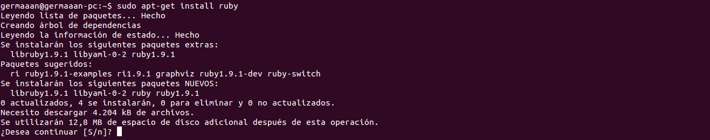

# Ejercicios 1:
### Instalar Ruby y usar `ruby --version` para comprobar la versión instalada. A la vez, conviene instalar también `irb`, `rubygems` y `rdoc`.

Instalamos Ruby usando `sudo apt-get install ruby`:



Comprobamos la versión instalada con `ruby --version` y obtenemos como salida:

```
ruby 1.9.3p194 (2012-04-20 revision 35410) [x86_64-linux]
```

Además también instalamos **irb**, **rubygems** y **rdoc** usando `sudo apt-get install irb rubygems rdoc`:


