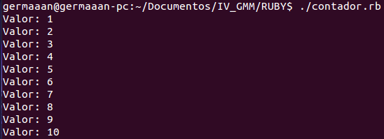

# Ejercicios 2:
### Crear un programa en Ruby que imprima los números desde el 1 hasta otro contenido en una variable.

Antes de hacer nuestro primer programa comprobamos donde se encuentra el interprete con `which ruby`, en mi caso es **/usr/bin/ruby**. Ahora creamos un programa que haga lo indicado, nos bastará con un usar un simple bucle **for**:

```
#!/usr/bin/ruby

	for i in 1..10
		puts "Valor: #{i}"
	end
```

Para comprobar que funciona, primero le damos permiso de ejecución (`chmod +x contador.rb`) y después lo ejecutamos (`./contador.rb`):


