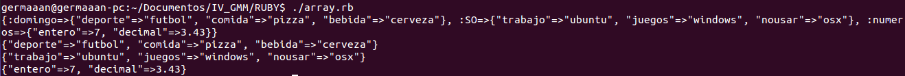

# Ejercicios 3:
### ¿Se pueden crear estructuras de datos mixtas en Ruby? Crear un array de hashes de arrays e imprimirlo.

Sí se pueden crear estructuras mixtas en Ruby, además fácilmente. Un programa de ejemplo con array de hashes de arrays podría ser el siguiente:

```
#!/usr/bin/ruby

	prueba = { :domingo => {"deporte" => 'futbol', "comida" => 'pizza', "bebida" => 'cerveza'}, :SO => {"trabajo" => 'ubuntu', "juegos" => 'windows', "nousar" => 'osx'}, :numeros => {"entero" => 7, "decimal" => 3.43}}

	puts prueba.inspect

	prueba.keys().each do |valor|
		puts prueba[valor]
	end
```

Cuya salida imprimida por pantalla queda tal que así:


