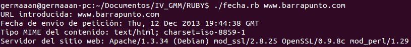

# Ejercicios 4:
### Crear una serie de funciones instanciadas con un URL que devuelvan algún tipo de información sobre el mismo: fecha de última modificación, por ejemplo. Pista: esa información está en la cabecera HTTP que devuelve

Para leer información de la web vamos a usar la librería **Net::HTTP**, así que lo primero es importarla en nuestro programa con `require 'net/http'`. Mediante el método `Net::HTTP.get_response(ARGV[0],'/')` enviamos una petición **GET** a la dirección que le hemos pasado al programa como argumento desde línea de comandos (**ARGV[0]**). De todas los campos de la cabecera HTTP de respuesta, solo hemos conseguido obtener una salida con **'date'**, **'content-type'** y **'server'**; correspondientes respectivamente a la fecha de envío de la petición, el tipo MIME del contenido y el servidor del sitio web. El código sería el siguiente:

```
#!/usr/bin/ruby
# -*- coding: utf-8 -*-

require 'net/http'

	def fecha()
		response = Net::HTTP.get_response(ARGV[0],'/')     
		return response['date'].to_s
	end

	def contenido()
		response = Net::HTTP.get_response(ARGV[0],'/')     
		return response['content-type'].to_s
	end

	def servidor()
		response = Net::HTTP.get_response(ARGV[0],'/')     
		return response['server'].to_s
	end

	url = ARGV[0]
	puts "URL introducida: " << url
	puts "Fecha de envío de petición: " << fecha()
	puts "Tipo MIME del contenido: " << contenido()
	puts "Servidor del sitio web: " << servidor()
```

Si por ejemplo le pasamos como argumento la dirección **"www.barrapunto.com"**, el resultado obtenido será:


