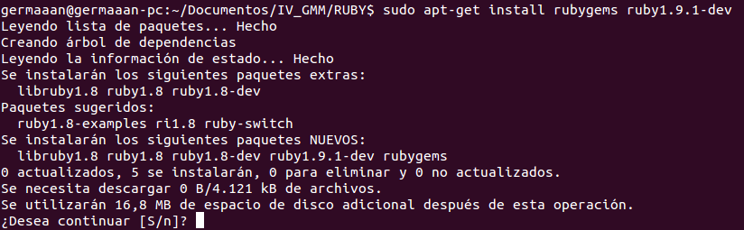
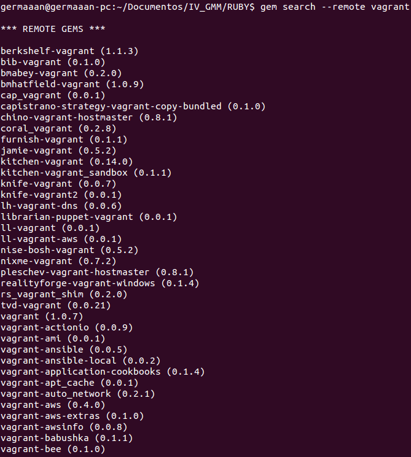
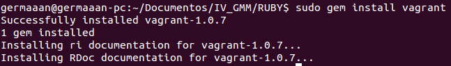

# Ejercicios 5:
### Ver si está disponible Vagrant como una gema de Ruby e instalarla.

Para evitar problemas a la hora de instalar módulos para Ruby instalamos los paquetes **rubygems** y **ruby1.9.1-dev** (este último depende de la versión de Ruby que tengamos instalada, para la versión **1.9.3p194** que es la que tengo instalada, el correspondiente paquete **dev** es el indicado, **ruby1.9.1-dev**). Usamos la orden `sudo apt-get install rubygems ruby1.9.1-dev`:

Queremos comprobar si **Vagrant** puede ser instalar como una gema de Ruby, por lo que lo buscamos con en la colección remota de gemas (`gem search --remote vagrant), obtendremos como resultado un listado con un montón de gemas, pero entre todas ellas vemos una llamada **vagrant (1.0.7)**, que es la que nos interesa:

Procedemos a instalar la gema mediante `sudo gem install vagrant`: 

