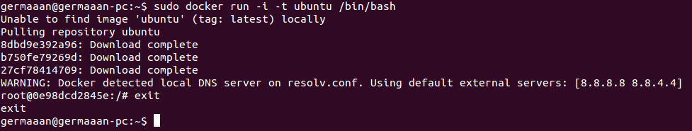
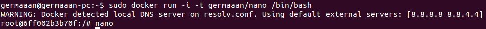

# Ejercicios 4:
### Hacer el tutorial de línea de órdenes de docker para comprender cómo funciona. Avanzado Instalarlo y crear una aplicación contenedorizada.

Vamos a realizar la instalación de Docker en una distribución Ubuntu Linux 13.04 (64 bit). Lo primero que tenemos que comprobar es que tenemos instalado como mínimo el kernel 3.8, en nuestro caso no es necesario, pero si fuera necesario actualizar el kernel, usaríamos el comando:
```
sudo apt-get install linux-image-extra-`uname -r`.
```
Ahora tenemos que agregar las llaves y el repositorio de Docker con los comandos `sudo sh -c "curl https://get.docker.io/gpg | apt-key add -` y `sudo sh -c "echo deb https://get.docker.io/ubuntu docker main > /etc/apt/sources.list.d/docker.list`.


Actualizamos con `sudo apt-get update` e instalamos Docker con `sudo apt-get install lxc-docker`. Para trabajar con Docker, vamos a meternos en su terminal con el comando `sudo docker run -i -t ubuntu /bin/bash`. Para salirnos introduciríamos `exit`.



Para crear una versión contenedorizada del editor de texto `nano`. Lo primero que hacemos es desde dentro del terminal de Docker, instalamos la aplicación con `sudo apt-get install nano`. Ahora desde otro terminal introducimos `sudo docker ps`, para así obtener el identificador del contenedor en el que hemos instalado `nano`. Seguidamente, creamos una imagen de dicho contenedor para poder usarlo directamente, esto lo hacemos con `sudo docker commit IDENTIFICADOR USUARIO/APLICACION`; vemos que la imagen se ha creado correctamente con `sudo docker images`.


Ahora podemos ejecutar directamente la imagen que acabamos de crear con 'sudo docker run -i -t germaaan/nano /bin/bash', así podremos usar directamente cuando queramos la imagen con "nano" que acabamos de crear.



Y podemos ver que la imagen que acabamos de ejecutar tiene su propio identificador.


