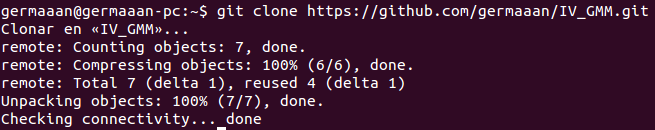

# Ejercicios 6:
## 1. Crear un proyecto y descargárselo con git. Al crearlo se marca la opción de incluir el fichero Readme.

Para crear un repositorio desde nuestra página principal de GitHub hacemos clic en la pestaña "Repositories" y pulsamos el botón que aparece "New". Para incluir el fichero "Readme", en la página de creación marcamos la casilla "Initialize this repository with a README".

Para descargárnoslo, siendo mi nombre de usuario en GitHub "germaaan" y el nombre del proyecto "IV_GMM", usaremos el comando `git clone https://github.com/germaaan/IV_GMM.git`.

## 2. Modificar el readme y subir el fichero modificado.

Una vez hayamos modificado el archivo README por el medio que sea, lo añadiremos a la lista de archivos a subir a nuestro repositorio con el comando `git add README.me`. Introducimos con `git commit -m "README modificado"` una descripción de la actualización que acabamos de hacer en el repositorio. Por último para que se apliquen dichos cambios, usamos `git push origin master`, pidiéndonos nuestros nombre de usuario y contraseña en caso de que no hayamos generado la clase SSH.

