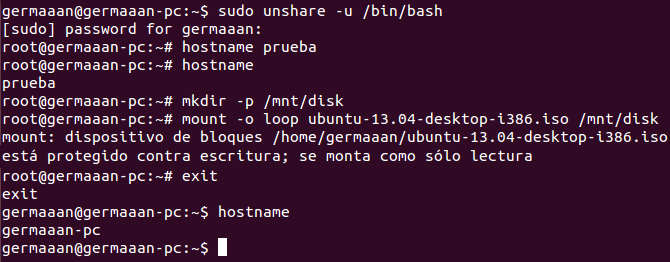

# Ejercicios 1:
### Crear un espacio de nombres y montar en él una imagen ISO de un CD de forma que no se pueda leer más que desde él. Pista: en ServerFault nos explican como hacerlo, usando el dispositivo loopback

Lo primero que haremos es crear el espacio de nombres en que vamos a montar la imagen ISO, para eso usamos el comando `sudo unshare -u /bin/bash`, por hacer una prueba vamos a cambiar el nombre del sistema `hostname NUEVO_NOMBRE` y comprobamos que se ha cambiado con `hostname`. Para montar la imagen, primero creamos el directorio en el que vamos a montar la imagen (`mkdir -p DIRECTORIO_MONTADO`), y seguidamente montamos la imagen (`mount -o loop NOMBRE_ARCHIVO_IMAGEN DIRECTORIO_MONTADO`). Podemos salirnos con `exit` y volver a comprobar el nombre del sistema para comprobar que estamos fuera del espacio de nombres que habíamos creado.

