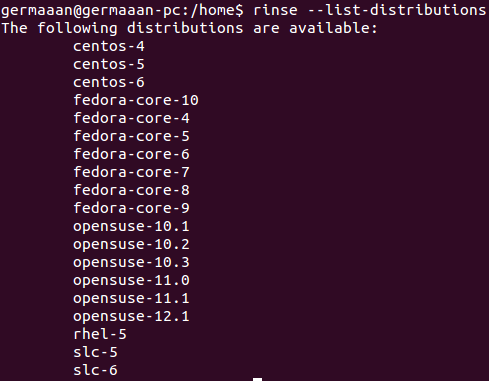

# Ejercicios 3:
### Usar debootstrap (o herramienta similar en otra distro) para crear un sistema mínimo que se pueda ejecutar más adelante.

Vamos a crear con `debootstrap` un sistema basado en la última versión estable de Ubuntu (13.10 Saucy Salamander, `saucy`) para una instalación de 64 bits (`--arch=amd64`) en un directorio que debe estar creado (`/home/jaulas/saucy/`). Necesitaremos también la dirección del repositorio para descargar los paquetes necesarios (`http://archive.ubuntu.com/ubuntu`):

```sudo debootstrap --arch=amd64 saucy /home/jaulas/saucy/ http://archive.ubuntu.com/ubuntu```


Una vez comprobado el sistema a instalar, recupera de la red los paquetes a instalar ("Retrieving"), los valida para comprobar que están correctos ("Validating"), los va extrayendo uno a uno ("Extracting"), los desempaqueta todos ("Unpacking") y los va configurando en la instalación ("Configuring"). Sabremos que la instalación ha finalizado cuando obtengamos el mensaje "Base system installed successfully".

### Experimentar con la creación de un sistema Fedora dentro de Debian usando Rinse.

Al igual que con `debootstrap` creamos un sistema basado en Fedora con `rinse`. Para conocer las distintos sistemas que podemos instalar con introducimos `rinse --list-distributions`:



Aunque vemos que aparecen muchas versiones de Fedora disponible, la versión más actualizada que he podido instalar es "Fedora Core 6" (`--distribution fedora-core-6`) para una instalación de 64 bits (`--arch=amd64`), en un directorio previamente creado (https://github.com/IV-GII/GII-2013`--directory /home/jaulas/fedora`):

```sudo rinse --arch=amd64 --distribution fedora-core-6 --directory /home/jaulas/fedora```


