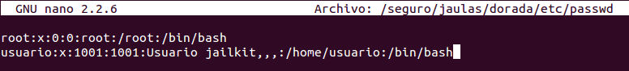

# Ejercicios 6:
### Crear una jaula y enjaular un usuario usando `jailkit`, que previamente se habrá tenido que instalar.

Hay que destacar que todos los pasos a realizar se realizan desde un terminal del sistema fuera de la jaula.

Primero tenemos que descargar `jailkit` desde su página web (`wget http://olivier.sessink.nl/jailkit/jailkit-2.16.tar.gz`), descomprimimos el archivo descargado (`tar -xzvf jailkit-2.16.tar.gz`) y procedemos a la instalación (`cd jailkit-2.16` y `./configure && make && sudo make install`).

Ahora necesitamos crear un sistema de ficheros perteneciente al usuario "root" que será sobre el que realizaremos la jaula con `jailkit` (`mkdir -p /seguro/jaulas/dorada` y `chown -R root:root /seguro`); y creamos nuestra jaula con un shell básico, herramientas de red y un editor de texto (`jk_init -v -j /seguro/jaulas/dorada jk_lsh basicshell netutils editors`).

Para terminar vamos a enjaular a un usuario, para ello tenemos que crear un usuario (`adduser usuario`) y lo enjaulamos con `sudo jk_jailuser -m -j /seguro/jaulas/dorada usuario`. Para poder conectarnos con el shell de la jaula tendremos que acceder al archivo "/seguro/jaulas/dorada/etc/passwd" y cambiar en la línea correspondiente al usuario que hemos enjaulado el shell que usa, pasando de "jk_lsh" a "bash":

