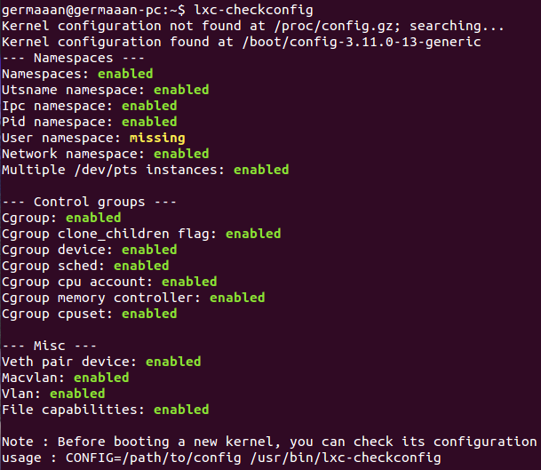
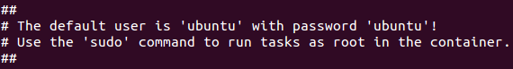
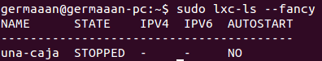
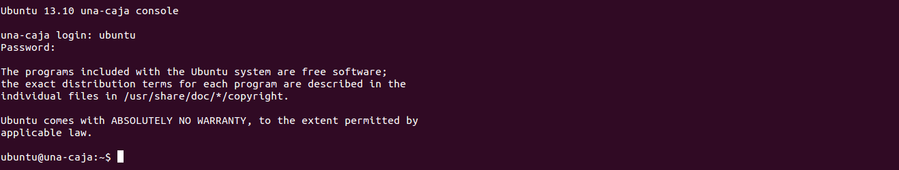

# Ejercicios 3:
### Crear y ejecutar un contenedor basado en Debian.

Antes de usar LXC deberemos comprobar si nuestro sistema está preparado para usar este tipo de tecnología y si está configurado correctamente, para ello ejecutamos `lxc-checkconfig`:

Vemos que aparece **User namespace: missing**, por lo que comentan en un comentario de [este hilo](https://bugs.launchpad.net/ubuntu/+source/linux/+bug/1191600/comments/9) el motivo de esto es que en las últimas versiones del kernel no se ha incluido la opción de activar "CONFIG_USER_NS" en el archivo de configuración del kernel dentro del directorio **/boot** para poder usar los espacios de usuario, aunque esto no debería impedir que LXC funcionase.

Después de las comprobaciones, procedemos a crear el contenedor usando `sudo lxc-create -t ubuntu -n una-caja`, necesitando primero descargar todos los paquetes para crear el contenedor antes de instalarlo y configurarlo para que sea funcional.

Una vez que el contenedor esté creado, nos indicará que el nombre de usuario y el password para acceder al mismo es **"ubuntu"**:

Comprobamos que el contenedor se ha creado correctamente listando todos los contenedores creados con LXC en nuestro sistema (`sudo lxc-ls --fancy`):

Y arrancamos dicho contenedor con `sudo lxc-start -n una-caja`, pidiéndonos ahora el terminal que introduzcamos el nombre de usuario y contraseña para acceder.

### Crear y ejecutar un contenedor basado en otra distribución, tal como Fedora. Nota En general, crear un contenedor basado en tu distribución y otro basado en otra que no sea la tuya.

(Pendiente de solucionar problemas con la instalación de Fedora en LXC...)
