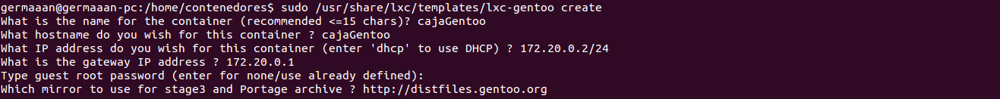
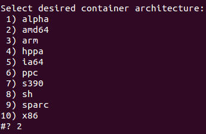
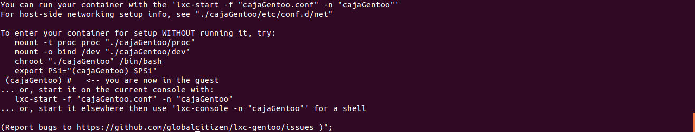
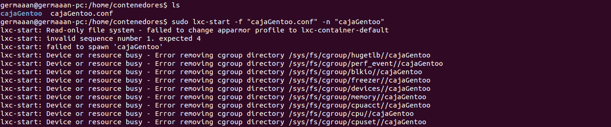
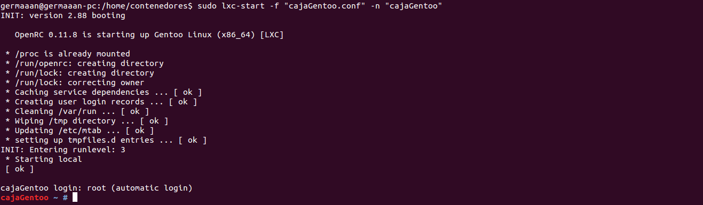

# Ejercicios 3:
### Crear y ejecutar un contenedor basado en Debian.

Antes de usar LXC deberemos comprobar si nuestro sistema está preparado para usar este tipo de tecnología y si está configurado correctamente, para ello ejecutamos `lxc-checkconfig`:


Vemos que aparece **User namespace: missing**, por lo que comentan en un comentario de [este hilo](https://bugs.launchpad.net/ubuntu/+source/linux/+bug/1191600/comments/9) el motivo de esto es que en las últimas versiones del kernel no se ha incluido la opción de activar "CONFIG_USER_NS" en el archivo de configuración del kernel dentro del directorio **/boot** para poder usar los espacios de usuario, aunque esto no debería impedir que LXC funcionase.

Después de las comprobaciones, procedemos a crear el contenedor usando `sudo lxc-create -t ubuntu -n una-caja`, necesitando primero descargar todos los paquetes para crear el contenedor antes de instalarlo y configurarlo para que sea funcional.


Una vez que el contenedor esté creado, nos indicará que el nombre de usuario y el password para acceder al mismo es **"ubuntu"**:


Comprobamos que el contenedor se ha creado correctamente listando todos los contenedores creados con LXC en nuestro sistema (`sudo lxc-ls --fancy`):


Y arrancamos dicho contenedor con `sudo lxc-start -n una-caja`, pidiéndonos ahora el terminal que introduzcamos el nombre de usuario y contraseña para acceder.


### Crear y ejecutar un contenedor basado en otra distribución, tal como Fedora. Nota En general, crear un contenedor basado en tu distribución y otro basado en otra que no sea la tuya.

Como ya se ha comentado en algún issue, no es posible crear correctamente un contenedor basado en Fedora en las ultimas versiones de Ubuntu, así que lo crearemos con Gentoo como se indica en el mismo issue.

Lo primero que tenemos que hacer es bajarnos es esta [plantilla](https://raw.github.com/globalcitizen/lxc-gentoo/master/lxc-gentoo) para instalar Gentoo en un contenedor LXC, después le damos permiso de ejecución para poder ejecutarlo.

```
sudo wget -P /usr/share/lxc/templates/ https://raw.github.com/globalcitizen/lxc-gentoo/master/lxc-gentoo
sudo chmod +x /usr/share/lxc/templates/lxc-gentoo
```

Ahora nos situamos en el directorio donde vamos a situar el contenedor (en mi caso, /home/contenedores), y ejecutamos la plantilla con la opción para crear el contenedor (`sudo /usr/share/lxc/templates/lxc-gentoo create`). Antes de crearlo nos pedirá la siguiente información:

* **"What is the name for the container (recommended <=15 chars)?":** El nombre que le daremos al contenedor, **"cajaGentoo"**.
* **"What hostname do you wish for this container ?":** El nombre del host del contenedor, **"cajaGentoo"**.
* **"What IP address do you wish for this container (enter 'dhcp' to use DHCP) ?":** La dirección IP del contenedor, dejamos la que viene por defecto, **172.20.0.2/24**.
* **"What is the gateway IP address ?":** La dirección IP de la puerta de enlaces, dejamos tambien la que viene por defecto, **172.20.0.1**.
* **"Type guest root password (enter for none/use already defined):"** La contraseña de **root**, podemos introducir alguna o dejarlo sin introducir.
* **"Which mirror to use for stage3 and Portage archive ?":** De donde descargarse los archivos de Gentoo, dejamos la dirección que viene por defecto, **"http://distfiles.gentoo.org"**.



Seleccionamos la arquitectura del sistema que irá en el contenedor (**"Select desired container architecture:"**), de entre todas he elegido la misma que la de mi sistema, **"amd64"**:



Seleccionamos la variante de la arquitectura seleccionada (**"Select desired container subarchitecture/variant for amd64:"**), en el caso de 
**"amd64"**, elegimos la propia opción **"amd64"**:


Una vez se hayan descargado y configurado todos los archivos necesarios, se nos mostrará por pantalla como arrancar el contenedor, introduciendo `lxc-start -f "ARCHIVO_CONFIGURACION.conf" -n "NOMBRE_CONTENEDOR"`:



En mi caso, la primera vez que ejecuté `sudo lxc-start -f "cajaGentoo.conf" -n "cajaGentoo"`, me aparecieron los errores que se ven en la siguiente imagen:



Buscando información, acabé en una página de documentación de Ubuntu sobre [LXC](https://help.ubuntu.com/lts/serverguide/lxc.html), que explica que LXC usa perfiles Apparmor como protección, no permitiendo entre otras cosas que se inicien contenedores desde sistemas de archivos nuevos montados fuera la raiz del sistema de archivos del contenedor. Para solucionar el problema con la política de protección de Apparmor, podemos desactivar el perfil correspondiente a LXC. Ejecutamos los siguientes comandos:

```
sudo apparmor_parser -R /etc/apparmor.d/usr.bin.lxc-start
sudo ln -s /etc/apparmor.d/usr.bin.lxc-start /etc/apparmor.d/disable/
```

Y añadimos la siguiente línea al principio del archivo de configuración del contendor (en este caso, **"cajaGentoo.conf"**):

```
lxc.aa_profile = unconfined
```

Si volvemos a intentar arrancar el contenedor (`sudo lxc-start -f "cajaGentoo.conf" -n "cajaGentoo"`), veremos que ahora arranca sin problemas:


