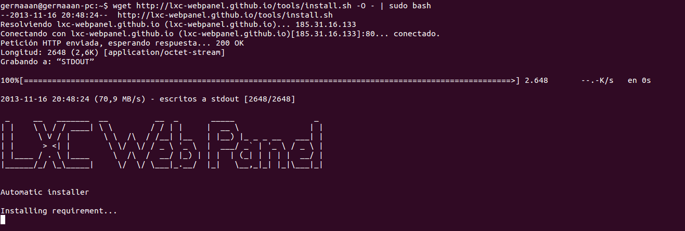
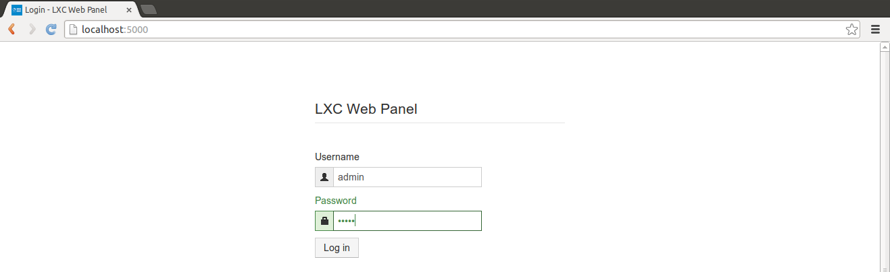
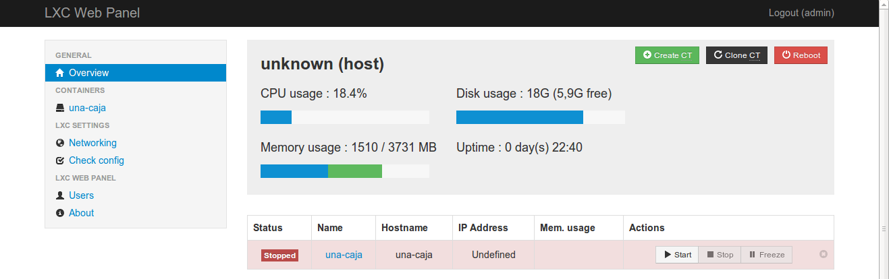
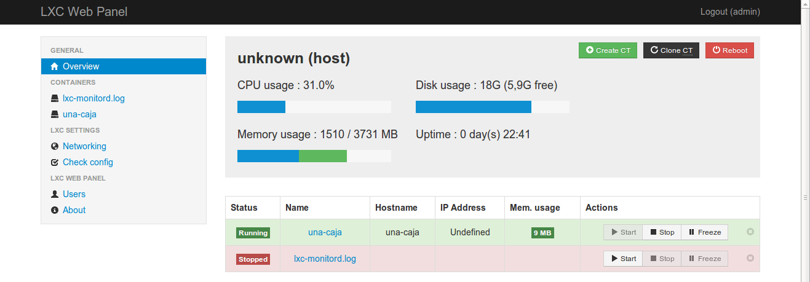
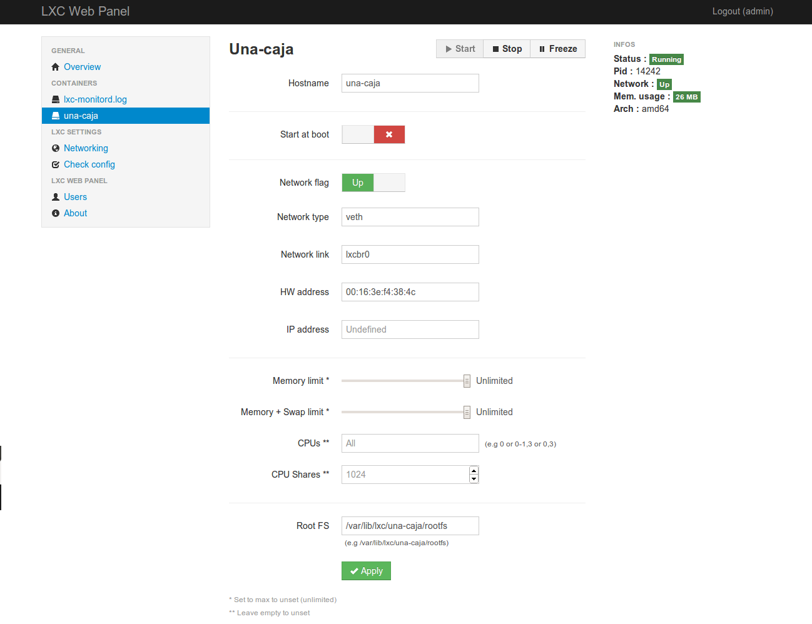

# Ejercicios 4:
### Instalar lxc-webpanel y usarlo para arrancar, parar y visualizar las máquinas virtuales que se tengan instaladas.

**lxc-webpanel** no se encuentra en los repositorios, así que tendremos que instalarlo como nos indican en su [página web](http://lxc-webpanel.github.io/install.html), introduciendo en una terminal `wget http://lxc-webpanel.github.io/tools/install.sh -O - | sudo bash` (**"sudo"** no lo indica, pero es necesario añadirlo ya que la instalación se tiene que hacer con privilegios de superusuario).

Una vez instalado, introducimos en cualquier navegador la dirección **"http://localhost:5000"** para acceder a la página de acceso de **LXC Web Panel** y nos identificamos con tanto nombre de usuario como contraseña **"admin"**.

Ya dentro, podemos ver que nos muestra información sobre nuestro sistema y las máquinas virtuales que tenemos instalados, en este momento solo tenemos la máquina **"una-caja"**, que se encuentra detenida.

Pero que si pulsamos el botón **"Start"** se inicia automáticamente, pasando su estado de **"Stopped"** a **"Running"**.

Además, si hacemos clic sobre el nombre de la máquina virtual accederemos a una página con más información sobre dicha máquina y desde la que podremos cambiar propiedades o restringir recursos.

### Desde el panel restringir los recursos que pueden usar: CPU shares, CPUs que se pueden usar (en sistemas multinúcleo) o cantidad de memoria.

Partiendo desde la página de información sobre la máquina virtual, en la parte inferior vemos que podemos gestionar los siguientes recursos:

* **Memory limit**: la cantidad de memoria total que estará disponible para la máquina virtual.
* **Memory + Swap limit**: la cantidad de memoria total más la cantidad de memoria de intercambio que estará disponible para la máquina virtual.
* **CPUs**: el procesador o procesadores específicos que podrá usar unicamente la máquina virtual.
* **CPU Shares**: limita la cantidad de porcentaje de procesamiento que los CPUs asignados le pueden dedicar al procesamiento de la máquina virtual.

