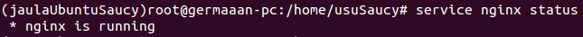
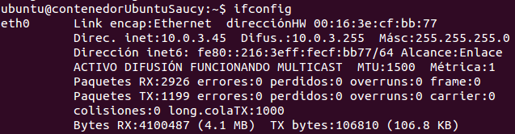

# Ejercicios 5:
### Comparar las prestaciones de un servidor web en una jaula y el mismo servidor en un contenedor. Usar nginx.

Para comparar las prestaciones vamos a usar una jaula y un contenedor con el mismo sistema instalado, **Ubuntu 13.10 64 bits**. Antes de realizar las pruebas vamos a comprobar que el servidor **nginx** funciona correctamente en ambos sistemas. Aunque no sea necesario, vamos a modificar la página de inicio por defecto para personalizarla, el archivo a editar se encuentra en **/usr/share/nginx/html/index.html**. Ahora comprobamos que el servidor está ejecutándose en ambos sistemas (`service nginx status`).

* Vemos que está ejecutándose en la jaula: 


* Vemos que también está ejecutándose en el contenedor:


La jaula tiene la misma dirección IP que el sistema anfitrión, pero cuando creamos un contenedor con LXC este crea una interfaz virtual para el contenedor con su propia dirección IP, así que comprobamos cual es la dirección del contenedor (`ifconfig`, la dirección es **"10.0.3.45"**).



Ya solo nos queda comprobar que los servidores funcione correctamente, así que desde el navegador de nuestro sistema accedemos a la dirección de ambos servidores.

* Para acceder al servidor instalado dentro del contenedor introducimos la dirección **"http://10.0.3.45/"**:


* Para acceder al servidor instalado dentro de la jaula introducimos la dirección **"http://127.0.0.1/"**:


Ambos servidores funcionan correctamente, por lo que vamos a medir las prestaciones de los mismos. Para realizar la medición vamos a usar la aplicación **"ab"** (Apache Benchmark), una utilidad muy sencilla que nos permite hacer pruebas de carga a cualquier tipo de servidor web. Para usarlo hay que indicar un número de conexiones a realizar y la concurrencia con la que se realizarán las mismas, para que los resultados sean más fiables vamos a realizar el test a cada servidor unas **10 veces**, con número de conexiones que será **1000000** y una concurrencia que será **10**. Además, para no tener que realizar todos los test manualmente, vamos a automatizarlos con el siguiente script:

```
#!/bin/bash
# Script para automatizar las pruebas de carga de los servidores nginx

# Prueba del servidor instalado en la jaula
for i in {1..10..1}
	do
		ab -n 1000000 -c 10 http://127.0.0.1/index.html > prueba_jaula_$i.txt
	done

# Prueba del servidor instalado en el contenedor
for i in {1..10..1}
	do
		ab -n 1000000 -c 10 http://10.0.3.45/index.html > prueba_contenedor_$i.txt
	done
```

Una vez hayan finalizado las pruebas, fijándonos sobretodo en el tiempo que tardan las pruebas en ejecutarse completamente, la cantidad de solicitudes que son atendidas por segundo y la velocidad de transferencia con la que se realizan dichas solicitudes, hemos obtenido los siguientes resultados:

|             |                      |      nginx (jaula)      |                                |                      |    nginx (contenedor)   |                                |
|:-----------:|:--------------------:|:-----------------------:|:------------------------------:|:--------------------:|:-----------------------:|:------------------------------:|
|             | Tiempo ejecución (s) | Solicitudes por segundo | Velocidad transferencia (KB/s) | Tiempo ejecución (s) | Solicitudes por segundo | Velocidad transferencia (KB/s) |
|:-----------:|:--------------------:|:-----------------------:|:------------------------------:|:--------------------:|:-----------------------:|:------------------------------:|
|   Prueba 1  |        59,281        |         16868,70        |             9043,86            |        81,518        |         12267,27        |             6528,97            |
|   Prueba 2  |        62,224        |         16070,97        |             8616,18            |        78,258        |         12778,27        |             6800,93            |
|   Prueba 3  |        64,783        |         15436,20        |             8275,85            |        61,809        |         16178,93        |             8610,86            |
|   Prueba 4  |        54,414        |         18377,72        |             9852,90            |        60,914        |         16416,53        |             8737,31            |
|   Prueba 5  |        49,227        |         20314,22        |            10891,12            |        60,948        |         16407,31        |             8732,41            |
|   Prueba 6  |        48,654        |         20553,21        |            11019,25            |        62,461        |         16010,11        |             8521,01            |
|   Prueba 7  |        49,459        |         20218,63        |            10839,87            |        70,132        |         14258,77        |             7588,90            |
|   Prueba 8  |        49,375        |         20253,15        |            10858,38            |        81,134        |         12325,35        |             6559,88            |
|   Prueba 9  |        48,507        |         20615,53        |            11052,66            |        79,725        |         12543,07        |             6675,76            |
|  Prueba 10  |        58,276        |         17159,65        |             9199,85            |        61,366        |         16295,59        |             8672,94            |
|             |                      |                         |                                |                      |                         |                                |
|    Media    |        54,420        |        18586,798        |            9964,992            |        69,827        |        14548,120        |            7742,897            |
| Desviación  |         5,933        |         1941,497        |            1040,900            |         8,844        |         1793,807        |             954,711            |

Observando los datos de desviación vemos que el dato más fiable para guiarnos y decidir que servidor da el mejor rendimiento es el tiempo de ejecución, y aunque en este caso la diferencia no es muy amplia (seguramente porque el número de conexiones es relativamente bajo, aunque esta diferencia podría cambiar considerablemente si elevasemos bastante el número de las mismas) vemos que el mejor rendimiento lo obtenemos con el servidor instalado en la jaula. Seguramente uno de los factores que hacen que se obtenga este resultado, es que la jaula está directamente "conectada" a la misma interfaz de red que el sistema anfitrión, mientras que el contenedor se conecta a través de una interfaz virtual que para comunicarse internamente es lo que este provocando este retardo cuando se producen las solicitudes de conexión al servidor.
