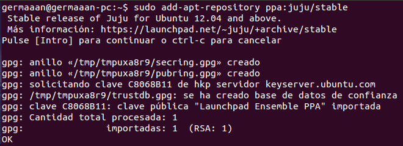
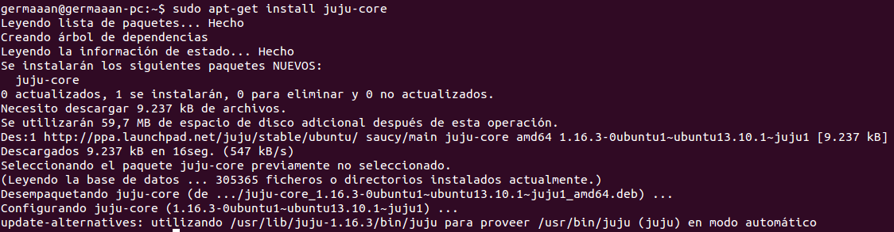
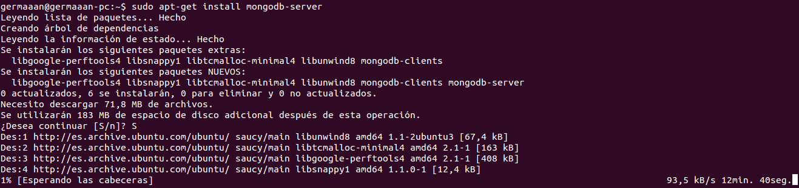
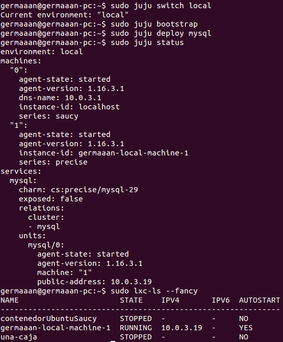

# Ejercicios 6:
### Instalar juju.

Para instalar **juju**, primero tenemos que añadir el repositorio de la aplicación, `sudo add-apt-repository ppa:juju/stable`:

Ahora solo nos queda actualizar los repositorios (`sudo apt-get update`) e instalar la aplicación (`sudo apt-get install juju-core`):

### Usándolo, instalar MySql en un táper.

Comenzamos a usar **juju**, primero tenemos que inicializarlo con `sudo juju init`, que crear el archivo con la información sobre las entornos de trabajo en **~/.juju/environments.yaml**. Como vamos a trabajar en local, editamos dicho fichero y buscamos la línea `default: amazon` (configurado por defecto para trabajar con la nube de Amazon), cambiándolo a `default: local` para establecer que por defecto vamos a trabajar localmente.

Para poder trabajar en local es necesario instalar **MongoDB** (para el que es necesario tener un gran capacidad libre en nuestro dispositivo de almacenamiento). Lo instalamos, `sudo apt-get install mongodb-server`:

Antes de instalar **MySQL**, establecemos que vamos a trabajar en el entorno de trabajo local (`sudo juju switch local`), como **juju** solo puede usar un táper que el mismo haya creado, así que lo creamos (`sudo juju bootstrap`). Para instalar servicios dentro del táper, usamos los **charms** (script YAML para realizar tareas comunes) de los que no provee el propio sistema, concretamente el de para instalar **MySQL** (`sudo juju deploy mysql`). Ya instalado comprobamos su estado con `sudo juju status`, donde vemos que aparece la máquina anfitriona (**machine "0"**), el táper de **juju** (**machine "1"**) y como servicio instalado aparece **mysql**; además, si ejecutamos `sudo lxc-ls --fancy` vemos que aparece un nuevo contenedor con el nombre **germaaan-local-machine-1**, que se corresponde al táper **machine "1"** de **juju**.

