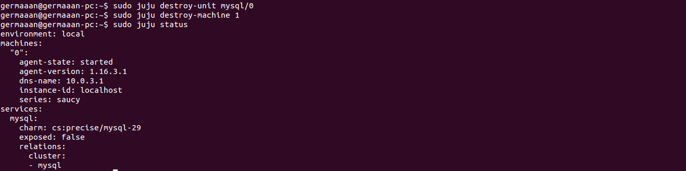
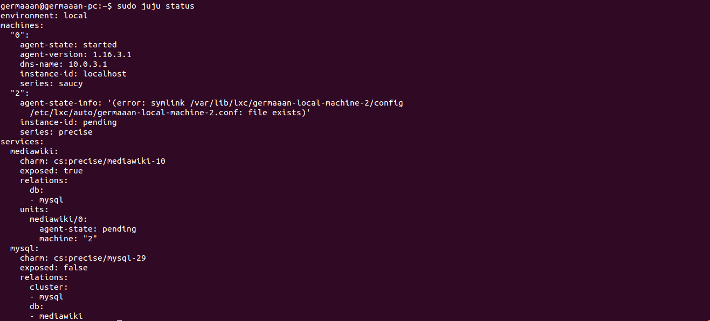
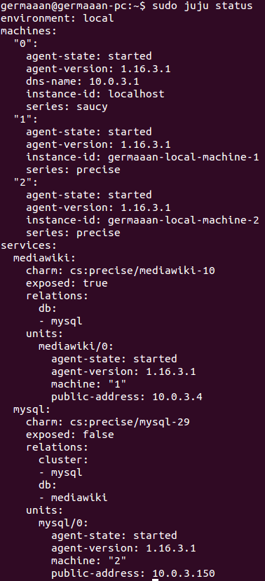
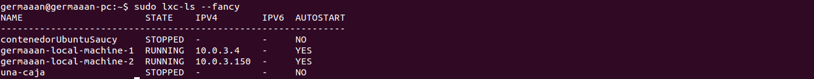
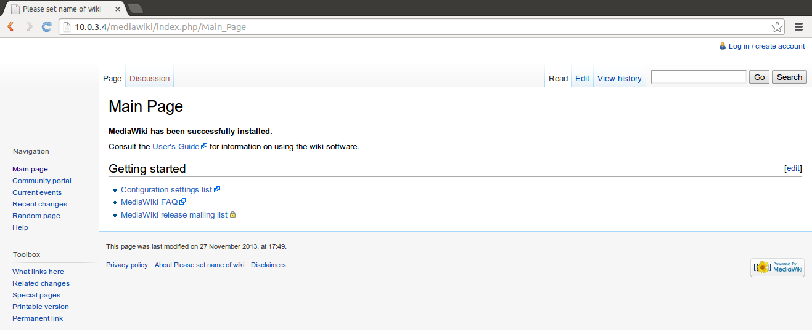

# Ejercicios 7:
### Destruir toda la configuración creada anteriormente.

Cuando queramos destruir toda la configuración deberemos hacerlo en el orden inverso al que fue creado, así que primero tendremos que elimintar la unidad de **mysq**l (`sudo juju destroy-unit mysql/0`) y después destruimos la máquina creada (`sudo juju destroy-machine 1`). Podemos observar el resultado de las acciones realizadas si hacemos `sudo juju status`:



### Volver a crear la máquina anterior y añadirle mediawiki y una relación entre ellos.

Volvemos a crear la máquina anterior (`sudo juju add-machine`), añadimos **mediawiki** (`sudo juju deploy mediawiki`) y añadimos una relación entre ellos (`sudo juju add-relation mediawiki:db mysql`). Para terminar solo nos queda exponer el servicio para que sea accesible al público (`sudo juju expose mediawiki`), pero esto produce un error aparentemente relacionado con la destrucción realizada en el punto anterior.



La solución ha sido realizar una destrucción total del entorno de juju con `sudo juju destroy-environment` y realizar de nuevo todos los pasos:

```
sudo juju bootstrap
sudo juju deploy mediawiki
sudo juju deploy mysql
sudo juju add-relation mediawiki:db mysql
sudo juju expose mediawiki
```

Si ahora hacemos `sudo juju status`, todo debería aparecer como que funciona correctamente:



Además las máquinas aparecen también como en funcionamiento si miramos el listado de máquinas de **LXC** (`sudo lxc-ls --fancy`):



Lo único que nos falta, es comprobar que verdaderamente funciona el servicio **mediawiki** que hemos instalado, para eso tenemos que fijarnos en la dirección IP pública (**"public-address"**) asociada a la unidad del **mediawiki** instalado que podemos ver en la salida del estado de **juju**, o también sabiendo en que máquina está, consultar su dirección IP (**"IPV4"**) en la tabla de máquinas existente de **LXC**. En cualquiera de los casos, una vez conozcamos la dirección IP debemos introducirla en un navegador y si todo funciona correctamente, accederemos a la página principal de **MediaWiki** con su configuración por defecto.



### Crear un script en shell para reproducir la configuración usada en las máquinas que hagan falta.

Simplemente tenemos que crear script al que vamos a llamar **"configura_juju.sh"** y cuyo contenido será básicamente los comandos usados en en la parte anterior. Hay que tener en cuenta que la ejecución de este script se tendrá que realizar con permisos de administrador (`sudo`):

```
#!/bin/bash
# Script para autoconfigurar juju con mysql y mediawiki en cualquier máquina

# Inicializar el entorno de juju
juju init
# Seleccionar un entorno de trabajo local
juju switch local
# Crear el contenedor juju
juju bootstrap
# Instalar mediawiki
juju deploy mediawiki
# Instalar mysql
juju deploy mysql
# Crear la relación necesaria entre mediawiki y mysql
juju add-relation mediawiki:db mysql
# Publicar el acceso al servicio mediawiki
juju expose mediawiki
```

Comprobamos con `sudo juju status` la configuración realizada, cuando todas las líneas **"agent-state"** pasen de **"pending"** a **"started"**, ya tendremos nuestro contenedor **MediaWiki** funcionando.

**NOTA: En ocasiones los charms de juju pueden tardar varias minutos en desplegarse, pudiendo pasar que si ejecutamos `sudo juju status` justo después de introducir los comandos veamos el "agent-state" a "pending" y pensemos que hemos realizado algún paso mal al no pasar a "started". Si nos fijamos en el indicador de disco duro del ordenador no para de parpadear, lo que significa que todavía no se habrán terminado de instalar los servicio, parece que el funcionamiento con MongoDB es algo muy pesado de hacer y puede tardar bastante (también se puede comprobar que MongoDB está realizando operaciones con juju si usamos el comando `top`), pero acaba apareciendo como "started" al cabo del rato.**
