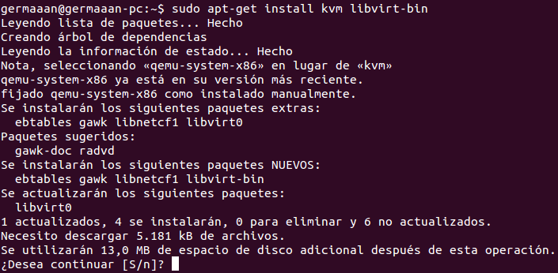
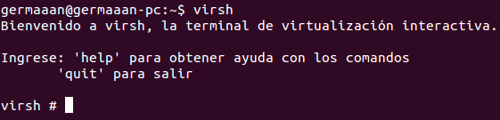

# Ejercicios 8:
### Instalar libvirt. Te puede ayudar [esta guía para Ubuntu](https://help.ubuntu.com/12.04/serverguide/libvirt.html).

**libvirt** es una biblioteca usada de interfaz con diferentes tecnologías de virtualización, la instalación es sencilla si seguimos los pasos del enlace del título. Lo primero que debemos comprobar para que **libvirt** funcione es que nuestro hardware soporta la extensión de virtualización necesaria para KVM, lo que comprobamos introduciendo `kvm-ok` y si es compatible obtenemos en salida el mensaje siguiente:

```
INFO: /dev/kvm exists
KVM acceleration can be used
```

Una vez comprobado esto instalamos los paquetes necesarios (`sudo apt-get install kvm libvirt-bin`):



El usuario con el que vayamos a manejar las máquinas virtuales debe pertenecer al grupo de **libvirt** por lo que lo añadimos con `sudo adduser $USER libvirtd`.

Como se comenta en los apuntes, otro aspecto interesante es que **libvirt** nos proporciona un shell para la gestión de línea de comandos, al que accedemos con `virsh`.



Este shell nos proporciona muchos comandos que podemos conocer introduciendo `help`, mostrándolos acompañados cada uno de una pequeña descripción y agrupados por categorías como son: gestión de dominios, monitorización de dominios, información sobre el host y el hipervisor, uso del interfaz o manejo de la red, entre otros.
