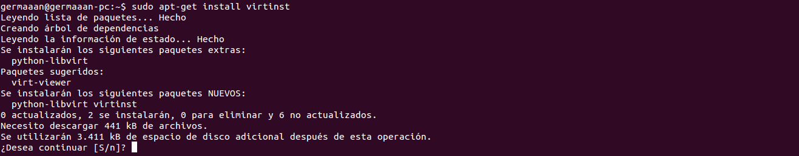
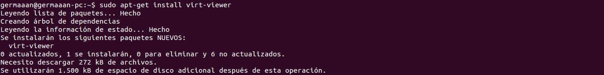
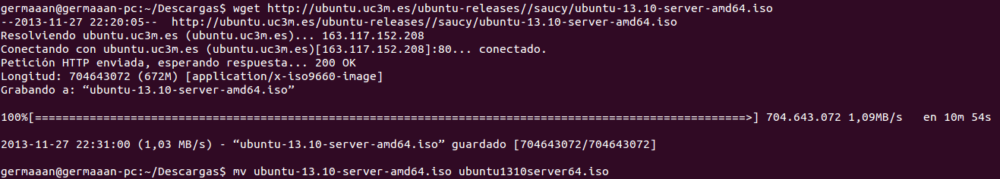
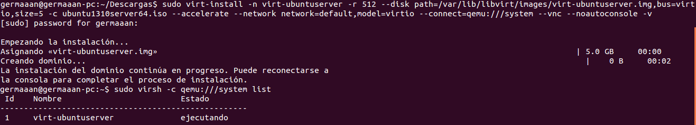
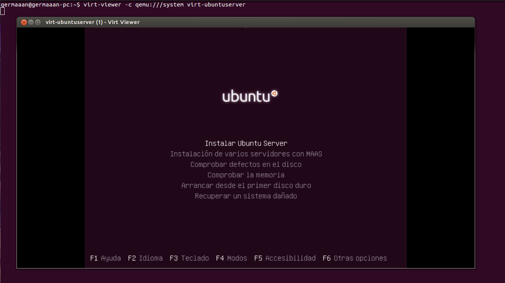

# Ejercicios 9:
### Instalar un contenedor usando virt-install.

Para empezar instalamos el propio **"virt-install"** (`sudo apt-get install virtinst`), que será el que nos permitirá instalar un sistema operativo en una máquina virtual:



También debemos instalar **"virt-viewer"** (`sudo apt-get install virt-viewer`), que nos permite conectarnos a la consola de la máquina virtual, pero además usando una interfaz gráfica para la interacción con la máquina virtual:



El sistema que vamos a instalar en el contenedor es **Ubuntu Server 13.10 64 bits**, necesitaremos la imagen ISO que podemos descargar desde [aquí](http://ubuntu.uc3m.es/ubuntu-releases//saucy/ubuntu-13.10-server-amd64.iso) (`wget http://ubuntu.uc3m.es/ubuntu-releases//saucy/ubuntu-13.10-server-amd64.iso`). Una vez descargada, le cambiamos el nombre para que sea mas accesible (`mv ubuntu-13.10-server-amd64.iso ubuntu1310server64.iso`).



Ha llegado el momento de comenzar la instalación con **"virt-install"** introduciendo la siguiente línea: 

```
sudo virt-install -n virt-ubuntuserver -r 512 --disk path=/var/lib/libvirt/images/virt-ubuntuserver.img,bus=virtio,size=5 -c ubuntu1310server64.iso --accelerate --network network=default,model=virtio --connect=qemu:///system --vnc --noautoconsole -v
```

* **"-n virt-ubuntuserver"**: el nombre de la máquina virtual.
* **"-r 512"**: la cantidad de memoria RAM en MB que usará la máquina virtual.
* **"--disk path=/var/lib/libvirt/images/virt-ubuntuserver.img,bus=virtio,size=5"**: la ruta en la que se almacenará el disco virtual del sistema, el bus que usará dicho disco y el tamaño en GB del mismo.
* **"-c ubuntu1310server64.iso"**: la imagen ISO a usar para instalar el sistema.
* **"--accelerate"**: activa la tecnología de aceleración del kernel.
* **"--network network=default,model=virtio"**: el interfaz de red a usar por la máquina virtual y el modelo del mismo.
* **"--connect=qemu:///system"**: el hipervisor al que se conecta.
* **"--vnc"**: exporta la consola virtual del huésped usando VNC.
* **"--noautoconsole"**: no conectar automáticamente a la consola de la máquina virtual.
* **"-v"**: crear un huésped totalmente virtualizado.

Una vez introducido **"virt-install"** creará el dominio para la máquina virtual y comenzará con la instalació de la misma. Si listamos las máquinas virtuales existentes (`sudo virsh -c qemu:///system list`), vemos que ya aparece listada.



Ahora para poder continuar la instalación desde el entorno gráfico, debemos conectarnos a la máquina virtual que acabamos de crear a través de **"virt-viewer"** (`virt-viewer -c qemu:///system virt-ubuntuserver`), apareciéndonos una ventana con la interfaz gráfica como podríamos ver en cualquier programa de virtualización que hayamos usado:


