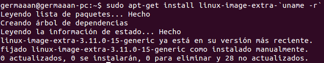
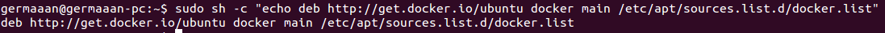
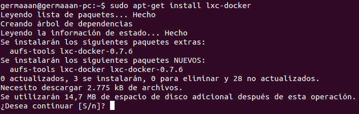
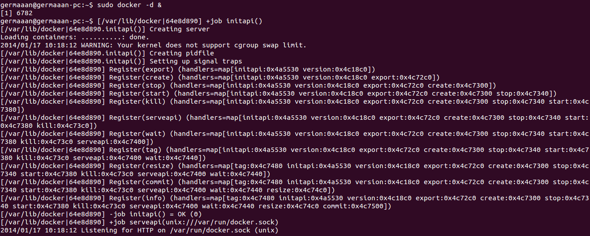

# Ejercicio 10
### Instalar docker.

Para instalar Docker necesitaremos que nuestra versión del kernel Linux sea mínimo 3.8, si no tenemos una de las últimas versiones la instalamos.

```
sudo apt-get update
sudo apt-get install linux-image-extra-`uname -r`
```



Añadimos la llave del repositorio:

```
sudo apt-key adv --keyserver keyserver.ubuntu.com --recv-keys 36A1D7869245C8950F966E92D8576A8BA88D21E9
```


Y ahora añadimos el repositorio de Docker:

```
sudo sh -c "echo deb http://get.docker.io/ubuntu docker main\ /etc/apt/sources.list.d/docker.list"
```



Una vez hayamos actualizado la lista de paquetes, podremos instalar **Docker** instalando el paquete **lxc-docker**.

```
sudo apt-get update
sudo apt-get install lxc-docker
```



Finalmente, lo arrancamos para poder comenzar a trabajar con él.

```
sudo docker -d &
```


