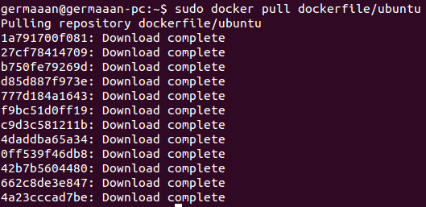
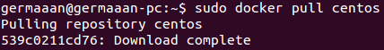
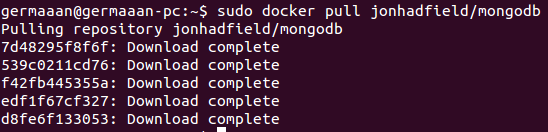
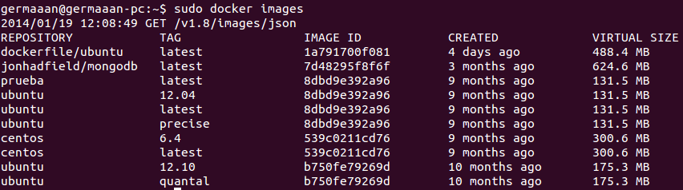

# Ejercicio 11
### Instalar a partir de docker una imagen alternativa de Ubuntu y alguna adicional, por ejemplo de CentOS.

Para instalar con Docker una imagen el procedimiento siempre es el mismo, introducir el comando `sudo docker pull NOMBRE_IMAGEN`. Así por ejemplo podemos instalar una imagen con Ubuntu 12.10 mantenida por el propio equipo de Dockerfile:

```
sudo docker pull dockerfile/ubuntu
```



O instalar una imagen de CentOS:

```
sudo docker pull centos
```



### Buscar e instalar una imagen que incluya MongoDB.

Buscando una imagen que tuviese MongoDB en su interior he encontrador esta imagen que tiene MongoDB 2.4.6 instalado en un sistema CentOS 6.4 de 64 bits:

```
sudo docker pull jonhadfield/mongodb
```



Compruebo todas las imágenes que acabo de instalar:

```
sudo docker images
```


