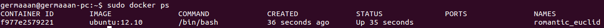
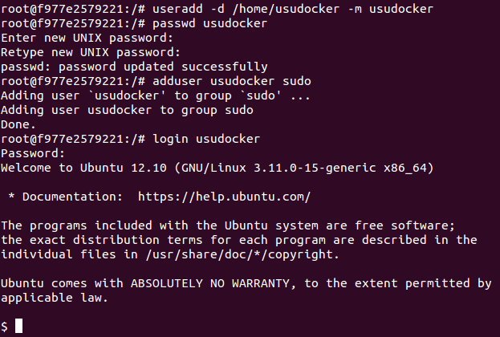
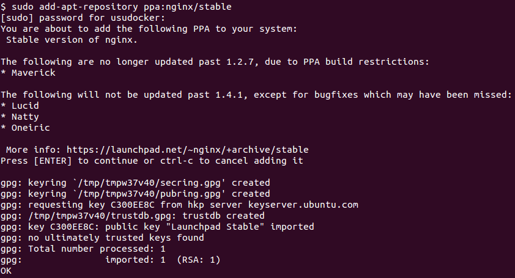
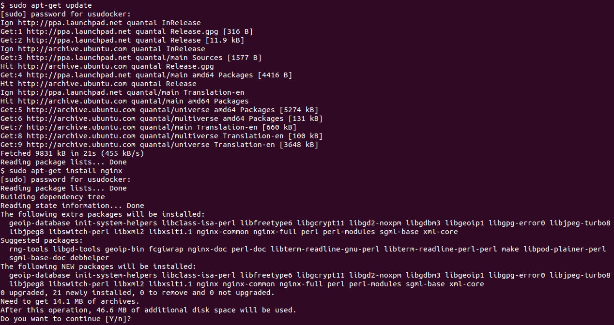

# Ejercicio 12
### Crear un usuario propio e instalar nginx en el contenedor creado de esta forma

Si iniciamos un seudo-terminal interactivo desde una imagen Ubuntu, podremos comprobar desde otro terminal que se ha creado un contenedor con dicha imagen.

```
sudo docker run -i -t ubuntu /bin/bash

sudo docker ps
```



Una de las primeras cosas que vamos a hacer en nuestro contenedor es crear un usuario propio, al que le voy a dar el nombre de **usudocker**, además lo añadiré al grupo **sudo** para que pueda realizar tareas que necesitan permisos de administración, como puede ser instalar paquetes.

```
useradd -d /home/usudocker -m usudocker
passwd usudocker
adduser usudocker sudo
login usudocker
```



Para instalar **nginx** primero hay que añadir su repositorio, como es un repositorio PPA, primero hay que instalar el siguiente paquete:

```
sudo apt-get install software-properties-common
```


Ahora sí, añadimos el repositorio de **nginx**.

```
sudo add-apt-repository ppa:nginx/stable
```



Y solo tenemos que actualizar la lista de paquetes e instalarlo.

```
sudo apt-get update
sudo apt-get install nginx
```


