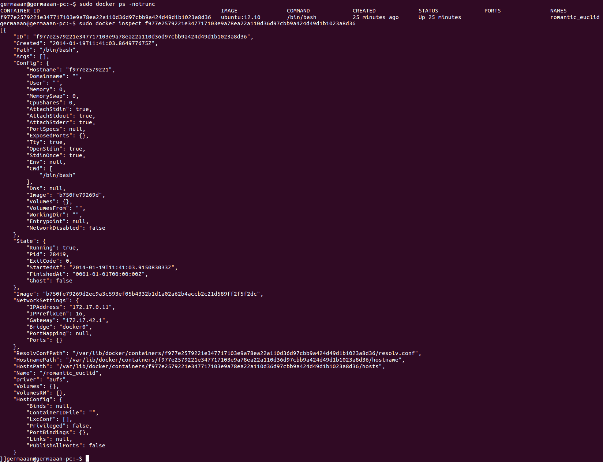
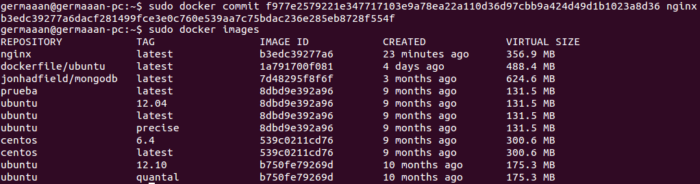
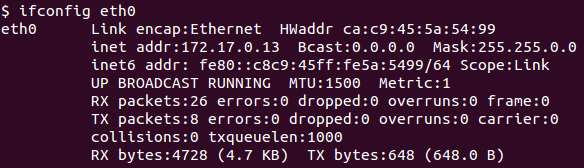
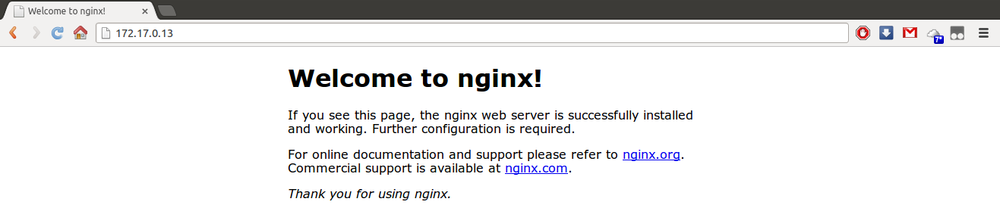

# Ejercicio 13
### Crear a partir del contenedor anterior una imagen persistente con commit.

Para crear una imagen persistente a partir de un contenedor necesitaremos mínimo conocer su ID largo, para eso añadimos al comando de lista los contenedores de Docker la opción `-notrunc`. Con este ID además podemos **"inspeccionar"** (opción **inspect**) dichos contenedores para obtener diversa información, como el nombre del host, la imagen cargada, si el contenedor está en funcionaniento o la dirección IP.

```
sudo docker ps -notrunc
sudo docker inspect f977e2579221e347717103e9a78ea22a110d36d97cbb9a424d49d1b1023a8d36
```



Así que simplemente usando la opción **commit**, el ID largo de nuestro contenedor y una etiqueta que usaremos para identificarlo, crearemos una imagen persistente con el estado actual de nuestro contenedor. La imagen aparecerá con el nombre de etiqueta que le hayamos dado en el listado con el resto de imágenes.

```
sudo docker commit f977e2579221e347717103e9a78ea22a110d36d97cbb9a424d49d1b1023a8d36 nginx
sudo docker images
```



Tener una imagen mínima de un sistema operativo con un servidor como **nginx** instalado es interesante, porque con pocos recursos podemos tener un servidor que podemos arrancar independientemente en cualquier momento, simplemente deberemos conocer su dirección IP.

```
ifconfig eth0
```



Y podremos acceder desde cualquier navegador que tenga acceso a esa dirección IP.


