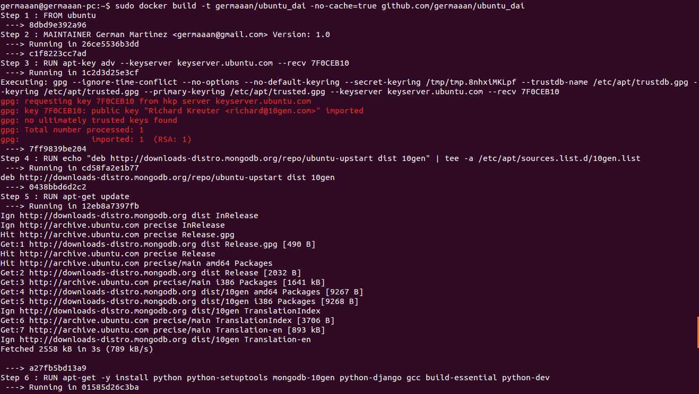
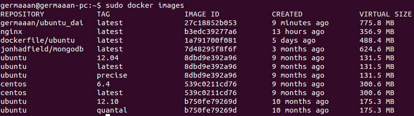
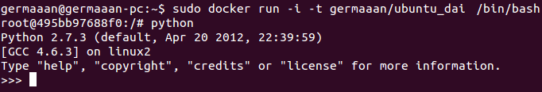
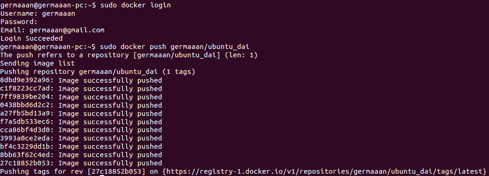
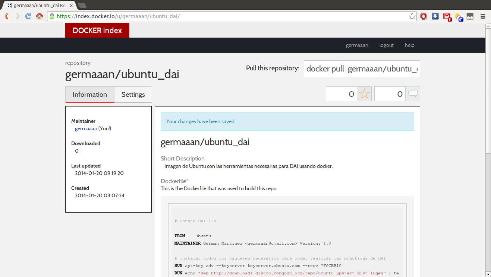
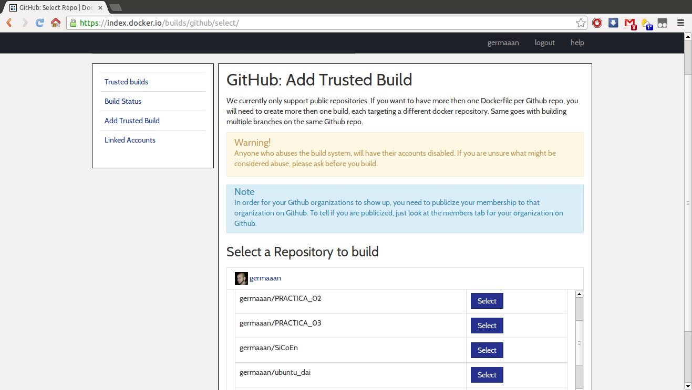
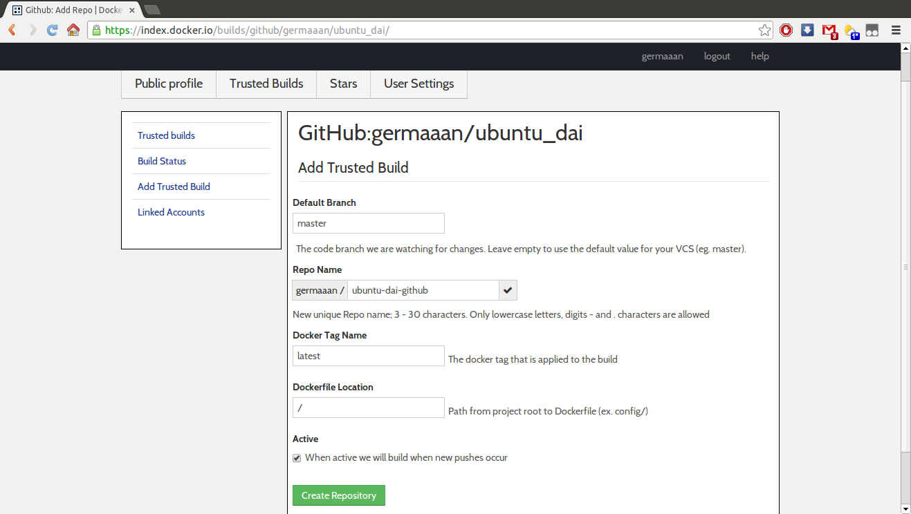
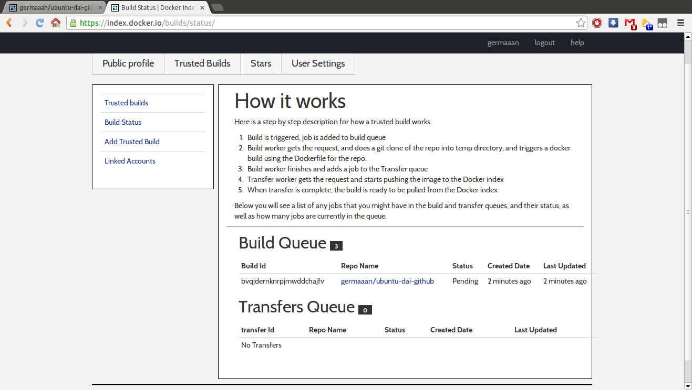
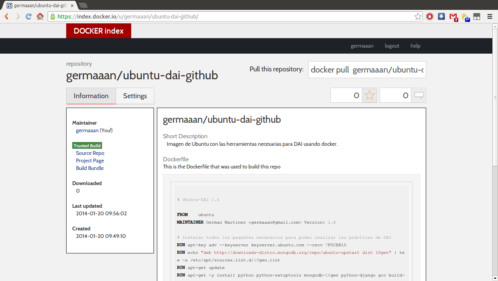

# Ejercicio 14
### Crear una imagen con las herramientas necesarias para DAI sobre un sistema operativo de tu elección.

Voy a crear una imagen de Ubuntu con todas las herramientas que hemos usado durante las prácticas de la asignatura de DAI. Para crear esta imagen voy a usar un Dockerfile que me cree con la imagen con los siguientes paquetes instalados:

* python
* mongodb
* easy-install
* django
* web.py
* mako
* pymongo
* feedparser
* tweepy

El archivo Dockerfile será el siguiente:

```
# Ubuntu-DAI 1.0

FROM    ubuntu
MAINTAINER German Martinez <germaaan@gmail.com> Version: 1.0

# Instalar todos los paquetes necesarios para poder realizar las prácticas de DAI
RUN apt-key adv --keyserver keyserver.ubuntu.com --recv 7F0CEB10
RUN echo "deb http://downloads-distro.mongodb.org/repo/ubuntu-upstart dist 10gen" | tee -a /etc/apt/sources.list.d/10gen.list
RUN apt-get update
RUN apt-get -y install python python-setuptools mongodb-10gen python-django gcc build-essential python-dev
RUN easy_install web.py
RUN easy_install mako
RUN easy_install pymongo
RUN easy_install feedparser
RUN easy_install tweepy
```

Como Docker permite crear una imagen usando un Dockerfile almacenado en un repositorio GitHUb, he subido el fichero a este [repositorio](https://github.com/germaaan/ubuntu_dai) que he creado para almacenarlo, con esto podemos aprovechar el control de versiones para las modificaciones que hagamos sobre el archivo para modificar la imagen a crear. Ahora solo queda crear la imagen:

```
sudo docker build -t germaaan/ubuntu_dai -no-cache=true github.com/germaaan/ubuntu_dai
```



Una vez la imagen ha terminado de crearse, podemos ver como aparece en el listado con el resto de imagenes:

```
sudo docker images
```



Compruebo que la imagen se ha creado correctamente iniciándola y comprobando que python está instalado correctamente:

```
sudo docker run -i -t germaaan/ubuntu_dai /bin/bash

python
```



Para terminar voy a compartir la imagen que acabo de crear, lo primero es crear una cuenta en [Docker Index](https://index.docker.io/account/signup/), siendo interesante también que vinculemos esta cuenta con nuestra cuenta de GitHub ya que esto nos permitirá crear imágenes que serán marcadas como "de confianza". Para compartir nuestra imagen, primero tendremos que hacer **login** en Docker desde un terminal y después hacer un **push** con el nombre de la imagen.

```
sudo docker login
sudo docker push germaaan/ubuntu_dai
```



Una vez haya terminado de subirse la imagen, su información estará disponible en esta [página](https://index.docker.io/u/germaaan/ubuntu_dai/), pudiendo instalarla directamente si introducimos el comando `sudo docker pull germaaan/ubuntu_dai`.



Otra opción podría ser añadir desde un repositorio GitHub, con lo que así veríamos que la imagen añadida sería referida como **"trusted repository**" que debería dar más confianza a la hora de descargarlo, ya que es construida por el propio sistema de Docker usando nuestro Dockerfile en el repositorio. Esto lo podemos hacer desde [aquí](https://index.docker.io/builds/github/select/) siempre que estemos debidamente registrados y con nuestra cuenta de GitHub vinculada, nos aparecerán todos nuestros repositorios, teniendo seleccionar el que queramos usar para crear la imagen:



Una vez seleccionada la imagen, añadimos su parámetros de configuración como son la rama principal de la que estar atenta a cambios, el nombre del repositorio, la etiqueta para docker y la localización del Dockerfile.



Ya está la imagen de confianza creada, solo falta que sea construida por Docker mediante el Dockerfile del repositorio para que sea totalmente válida, una vez que haya sido construida ya podrá ser instalado usando `sudo docker pull germaaan/ubuntu-dai-github`. Podemos comprobar el estado de la imagen desde la sección [**"Trusted Builds/Build Status"**](https://index.docker.io/builds/status/).



En cualquier caso la [página](https://index.docker.io/u/germaaan/ubuntu-dai-github/) de la imagen estará disponible desde el mismo momento que creemos la imagen de confianza.


