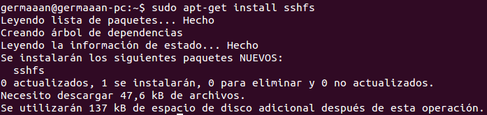
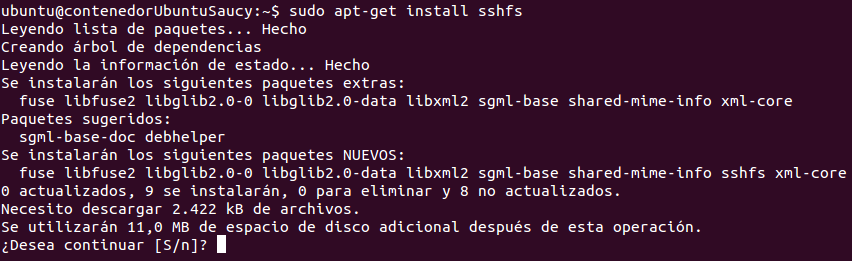
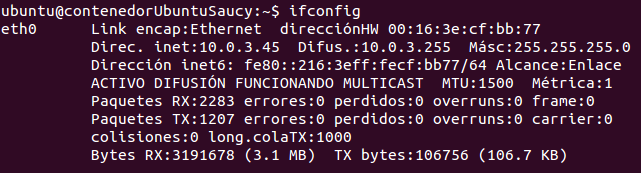
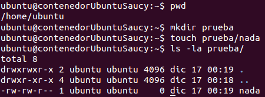
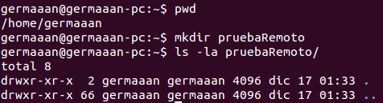
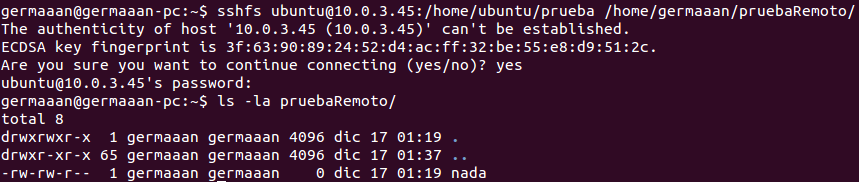
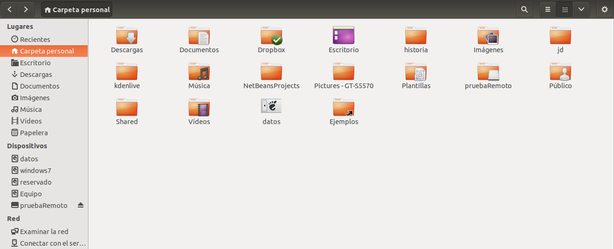
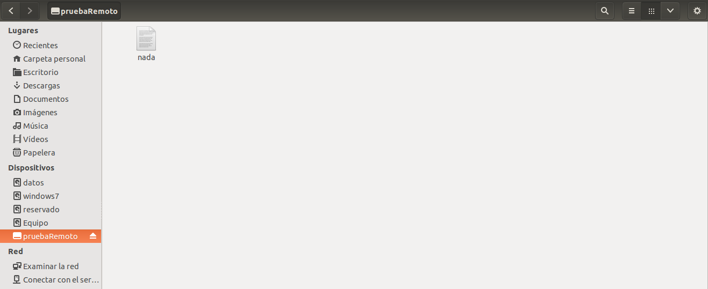

# Ejercicios 2:
### Usar FUSE para acceder a recursos remotos como si fueran ficheros locales. Por ejemplo, sshfs para acceder a ficheros de una máquina virtual invitada o de la invitada al anfitrión. 

Para usar `sshfs` desde el anfitrión lo instalamos primero en él (`sudo apt-get install sshfs`):



Ahora instalamos también `sshfs` es la máquina virtual invitada (`sudo apt-get install sshfs`). Como vemos, si alguno de los sistemas no tiene instalado `fuse`, este será instalado para cumplir las dependencias.



En la máquina virtual, tenemos que añadir al grupo `fuse` el usuario con el que nos conectaremos remotamente a la máquina virtual, para este caso vamos a usar un usuario llamado **ubuntu**:

```
sudo usermod -a -G fuse ubuntu
```

Para acceder a los recursos remotos necesitaremos conocer la dirección IP de la máquina virtual a la que nos vamos a conectar (`ifconfig`):



Como ejemplo para este ejercicio, vamos a crear en la máquina virtual un directorio llamado **prueba** en el directorio **home** del usuario **ubuntu**, y dentro crearemos un archivo vacío llamado **prueba**:



Necesitamos también crear en el anfitrión un directorio en el que montamos el directorio remoto como si fuera local, vamos a crearlo en nuestro directorio **home** con el nombre **pruebaRemota**:



Y ya solo nos queda conectarnos indicando el nombre del usuario remoto (**ubuntu**), la dirección IP de la máquina remota (**10.0.3.45**), la ruta del recurso remoto (**/home/ubuntu/prueba**) y la ruta del recurso local en el que montamos dicho recurso remoto (**/home/germaaan/pruebaRemota**):

```
sshfs ubuntu@10.0.3.45:/home/ubuntu/prueba /home/germaaan/pruebaRemoto
```



Si vamos a nuestro directorio **home** local, vemos que la carpeta **pruebaRemota** ya no tiene el mismo icono de carpeta típico; además, en el panel de la izquierda, en **Dispositivos** ahora nos aparece una nueva unidad de disco llamada **pruebaRemota**:



Accedemos dentro para comprobar que ciertamente se ha montado el directorio remoto y tiene el mismo archivo de prueba que creamos en el mismo:



