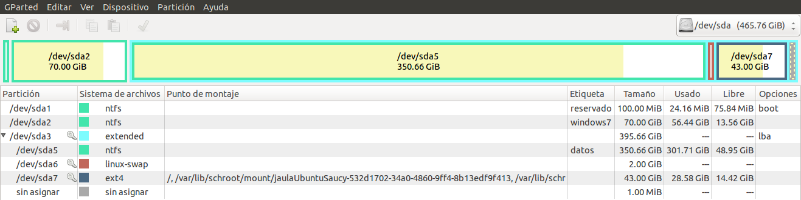

# Ejercicios 1:
### Usar FUSE para acceder a recursos remotos como si fueran ficheros locales. Por ejemplo, sshfs para acceder a ficheros de una máquina virtual invitada o de la invitada al anfitrión. 

### Avanzado Usar los drivers de FUSE para Ruby ([aquí explican más o menos como hacerlo con fusefs](http://www.debian-administration.org/articles/619) para mostrar el contenido de una estructura de datos en un lenguaje como si fuera un fichero. [Este es un ejemplo en Python](http://www.stavros.io/posts/python-fuse-filesystem/).

### Si tienes acceso en tu escuela o facultad a un ordenador común para las prácticas, ¿qué almacenamiento físico utiliza?

### Buscar ofertas SAN comerciales y comparar su precio con ofertas locales (en el propio ordenador) equivalentes.

He encontrar 2 ofertas de SAN comerciales de HP: [HP P2000 G3 FC DC SMB SAN Starter Kit-AP847B](http://h71016.www7.hp.com/MiddleFrame.asp?page=config&ProductLineId=450&FamilyId=2569&BaseId=39751&oi=E9CED&BEID=19701&SBLID=) y [HP P2000 G3 FC DC Virtual SAN Starter Kit-AP848B](http://h71016.www7.hp.com/MiddleFrame.asp?page=config&ProductLineId=450&FamilyId=2569&BaseId=39693&oi=E9CED&BEID=19701&SBLID=). El primero con un precio de **16.500$ (11.978'22€)** tiene un interfaz con una conexión basada en un **canal de fibra** a **8 Gbit/s** y **12 unidades SAS/SATA LFF de 3'5 pulgadas** con una capacidad total de **48 TB**, el segundo con un precio de **24.170$ (17.546'28€)** tiene tambien un **canal de fibra** a **8 Gbit/s** Y **24 unidades SAS SFF de 2'5 pulgadas** con una capacidad total de **28'8 TB**.

Para realizar la comparativa he elegido los siguientes discos duros: [WD Red 4 TB Hard Drive for NAS (WD40EFRX)](http://www.pccomponentes.com/wd_nas_red_4tb_sata3.html) y [WD Red 1 TB Hard Drive for NAS (WD10JFCX)](http://www.pccomponentes.com/wd_nas_red_2_5__1tb_sata3.html). El primero tiene un precio de **169€** y es una unidad **SATA3 de 3'5 pulgadas** con una capacidad de **4 TB**, el segundo tiene un precio de **75'95€** y es una unidad **SATA3 de 2'5 pulgadas** con una capacidad de **1 TB**.

Pero además necesitariamos adquirir carcasas de red **(NAS)** en la que conectar dichos discos duros como podría ser [Synology DiskStation DS1813+ NAS 8HD](http://www.pccomponentes.com/synology_diskstation_ds1813__nas_8hd.html) que con un precio de **899€**, necesitariamos 2 en el caso de las unidades de 3'5 pulgadas o 4 en el caso de las unidades de 2'5 pulgadas. 

En la tabla vemos una comparativa de precio entre ambos dispositivos:

|                   |   | HP AP847B | WD40EFRX |   | HP AP848B | WD10JFCX |
|:-----------------:|---|:---------:|:--------:|---|:---------:|:--------:|
|   Capacidad (TB)  |   |     48    |     4    |   |    28'8   |     1    |
|    Equivalencia   |   |     1     |    12    |   |     1     |    29    |
| Precio unidad (€) |   | 11.978'22 |    169   |   | 17.546'28 |   75'95  |
|   NAS necesarios  |   |     0     |     2    |   |     0     |     4    |
|   Precio NAS (€)  |   |    899    |    899   |   |    899    |    899   |
|  Precio final (€) |   | 11.978'22 |   3.826  |   | 17.546'28 | 5.798'55 |

Aparentemente el sistema local sería mucho más barato, aunque seguramente no estaría igual de optimizado, además que la interfaz de conexión mediante canal de fibra a 8 Gbit/s es muy superior a la conexión Gigabit mediante LAN.
