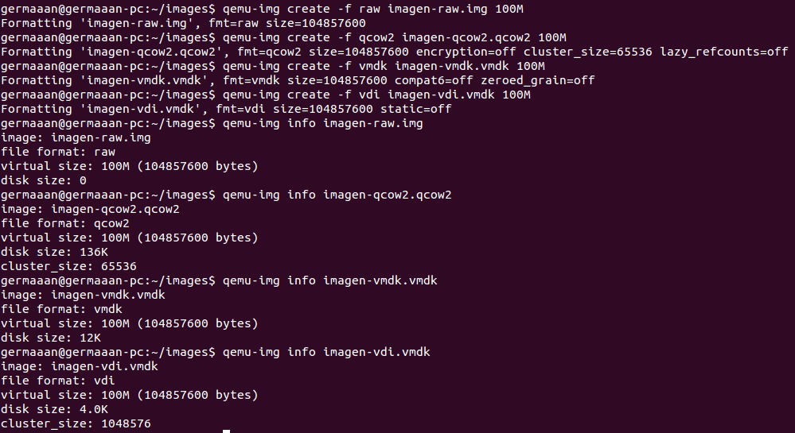
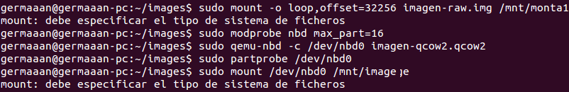
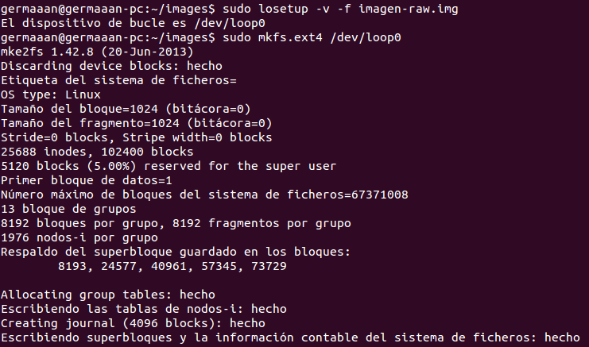
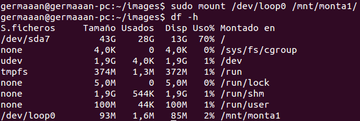

# Ejercicios 3:
### Crear imágenes con estos formatos (y otros que se encuentren tales como VMDK) y manipularlas a base de montarlas o con cualquier otra utilidad que se encuentre

Vamos a probar los diferentes tipos de imágenes que soporta [QEMU](http://en.wikibooks.org/wiki/QEMU/Images), todos pueden ser generados con **qemu-img** siguiendo el patrón `qemu-img create -f FORMATO NOMBRE_ARCHIVO TAMAÑO`, por ejemplo:

* **raw**: qemu-img create -f raw imagen-raw.img 100M
* **qcow2**: qemu-img create -f qcow2 imagen-qcow2.qcow2 100M
* **vmdk**: qemu-img create -f vmdk imagen-vmdk.vmdk 100M
* **vdi**: qemu-img create -f vdi imagen-vdi.vmdk 100M



Como estás imagenes están recien creados y en blanco, no tienen ningún formato de sistema de archivos, por lo que si intentamos montarlas obtendremos un error.

Montar la imagen como un dispositivo **loop**:

```
sudo mount -o loop,offset=32256 imagen-raw.img /mnt/monta1
```

Montar la imagen como un dispositivo **NBD**:

```
sudo modprobe nbd max_part=16
sudo qemu-nbd -c /dev/nbd0 imagen-qcow2.qcow2
sudo partprobe /dev/nbd0
sudo mount /dev/nbd0 /mnt/image
```



Para poder montarlos deberemos primero convertir los archivos de imagen en dispositivos **loop** (`sudo losetup -v -f imagen-raw.img`) y seguidamente darle un formato de sistema de archivos cualquiera como puede ser **ext4** (`sudo mkfs.ext4 /dev/loop0`):



Ahora ya podremos montar la imagen como el dispositivo **loop** correspondiente (`sudo mount /dev/loop0 /mnt/monta1/`), comprobando que se ha montado correctamente (`df -h`):


