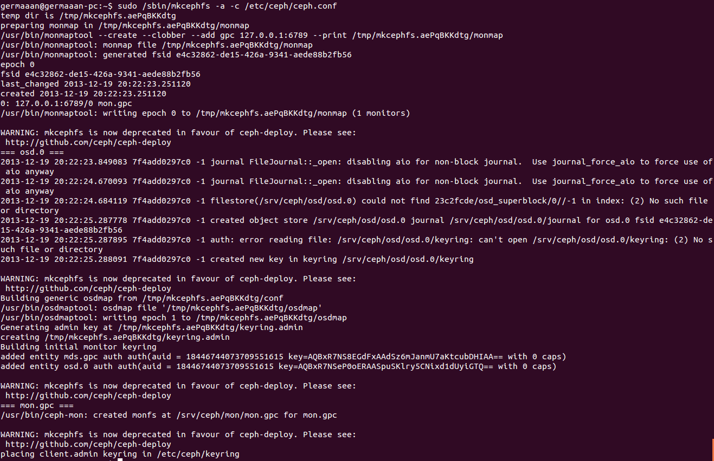
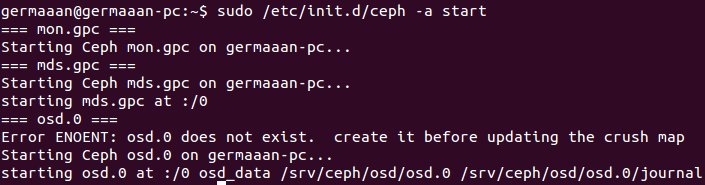
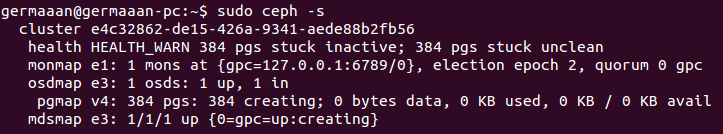

# Ejercicios 6:
### Crear un dispositivo ceph usando BTRFS o XFS

Ya que tenemos Ceph instalado, ahora toca configurarlo. Lo primero que haremos será crear los directorios donde se va a almacenar la información de Ceph:

```
sudo mkdir -p /srv/ceph/{osd,mon,mds}
```

Seguidamente creamos el archivo de configuración **/etc/ceph/ceph.conf**, configurando el monitor de objetos (**mon**), el servidor de metadatos (**mds**) y el dispositivo servidor de objetos (**osd**). Para esto introducimos lo siguiente:

```
[global]
	log file = /var/log/ceph/$name.log
	pid file = /var/run/ceph/$name.pid
[mon]
	mon data = /srv/ceph/mon/$name
[mon.gpc]
	host = germaaan-pc
	mon addr = 127.0.0.1:6789
[mds]
[mds.gpc]
	host = germaaan-pc
[osd]
	osd data = /srv/ceph/osd/$name
	osd journal = /srv/ceph/osd/$name/journal
	osd journal size = 1000
[osd.0]
	host = germaaan-pc
	xfs devs = /dev/loop0
```

Necesitamos crear un sistema bucle con formato con sistema **xfs** para que haga la función de dispositivo servidor de objetos (el que hemos indicado en el archivo de configuración como **/dev/loop0**/):

```
qemu-img create -f raw ceph_osd.img 2G
sudo losetup -v -f ceph_osd.img
sudo mkfs.xfs /dev/loop0
```


Tenemos que crear un directorio necesario para el servidor de objetos:

```
sudo mkdir /srv/ceph/osd/osd.0
```

Creamos el sistema de ficheros de objetos:

```
sudo /sbin/mkcephfs -a -c /etc/ceph/ceph.conf
```



Iniciamos el servicio:

```
sudo /etc/init.d/ceph -a start
```



Comprobamos si se ha iniciado correctamente comprobando el estado del Ceph:

```
sudo ceph -s 
```




Y finalmente creamos el directorio donde lo vamos a montar y lo montamos:

```
sudo mount -t ceph germaaan-pc:/ /mnt/ceph
```

Pero no funciona, da como resultado `mount error 5 = Input/output error`.
