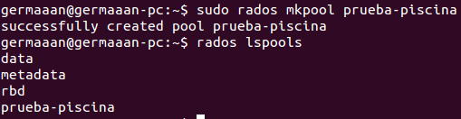
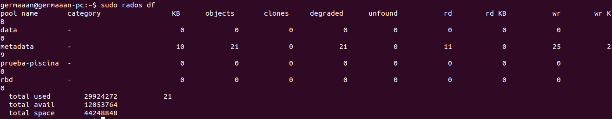
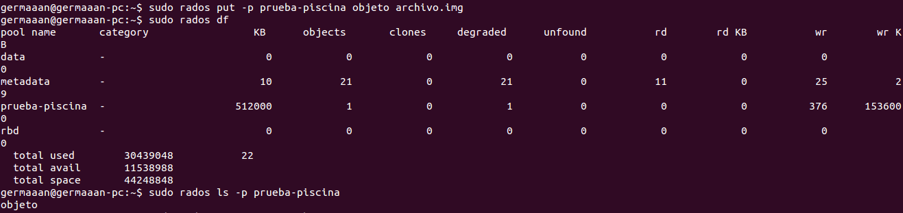
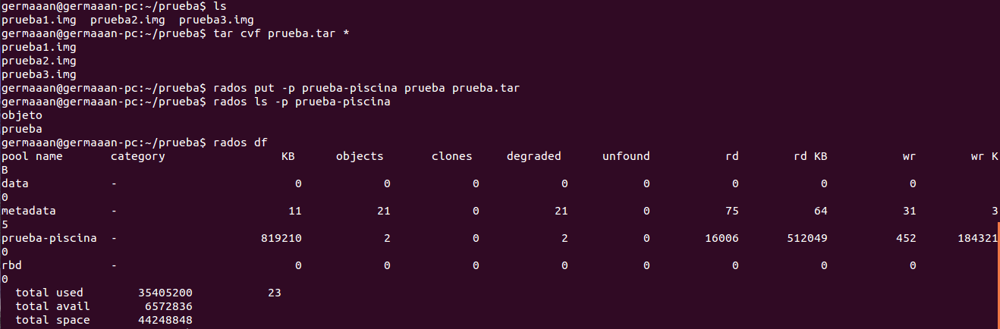

# Ejercicios 7:
### Almacenar objetos y ver la forma de almacenar directorios completos usando ceph y rados. 

Para almacenar los objetos en **rados** lo primero que deberemos es crear una piscina (`rados mkpool prueba-piscina`) y comprobar que se ha creado (`rados lspools`):



Como todavía no hemos almacenado nada en la piscina, podemos ver que su contenido es vacío (`rados df`):



Ahora introducimos cualquier archivo que tengamos en nuestro sistema (ejemplo: `rados put -p prueba-piscina objeto archivo.img`). Ahora vemos que el tamaño ocupado de nuestra piscina ha aumentado (`rados df`) y listando el contenido de la piscina, aparece el archivo que hemos almacenado (`rados ls -p prueba-piscina`):



En el caso de que queramos almacenar directorios completos, como **rados** no permite almacenar un directorio como tal, podríamos empaquetar en un **tar** todo los archivos del directorio y subirlos con el nombre de dicho directorio como objeto a la piscina:

```
tar cvf prueba.tar *
rados put -p prueba-piscina prueba prueba.tar
rados ls -p prueba-piscina
rados df
```


