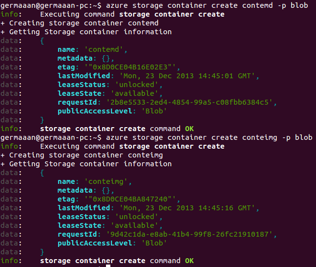
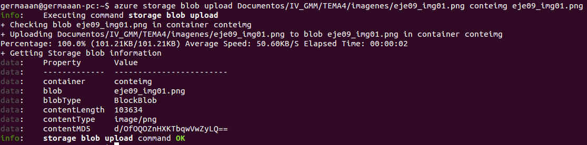

# Ejercicios 9:
### Crear varios contenedores en la cuenta usando la línea de órdenes para ficheros de diferente tipo y almacenar en ellos las imágenes en las que capturéis las pantallas donde se muestre lo que habéis hecho.

Vamos a subir todo lo que hagamos en este ejercicio a la cuenta de almacenamiento que creamos en el ejercicio anterior, así que para seguir la estructura con la que suelo documentar los ejercicios, crearé un contenedor para archivos Markdown y otro contenedor para archivos de imagen. Importante que para que sean accesibles publicamente tenemos que asignarle al contenedor un nivel de acesso público (**publicAccessLevel**).

```
azure storage container create contemd -p blob
azure storage container create conteimg -p blob
```



Ahora para subir por ejemplo el archivo de imagen que acabamos de insertar en este documento, tenemos que indicar: la ruta del archivo a almacenar, el nombre del contenedor en el que almacenarlo y el nombre del archivo dentro del contenedor.

```
azure storage blob upload ~/Documentos/IV_GMM/TEMA4/imagenes/eje09_img01.png conteimg eje09_img01.png
```



El archivo que acabamos de subir será accesible desde la dirección [http://germaaan.blob.core.windows.net/conteimg/eje09_img01.png](http://germaaan.blob.core.windows.net/conteimg/eje09_img01.png)

Subimos también esta última imagen y este propio documento Markdown a sus respectivos contenedores (**conteimg** y **contemd**). Simplemente escribiré las líneas de comando a introducir, porque subir una imagen que refleje la realización de una acción mientras se realiza dicha acción que refleja la imagen podría provocar una paradoja espaciotemporal que tendría el riesgo de absorbernos a todos.

```
azure storage blob upload ~/Documentos/IV_GMM/TEMA4/imagenes/eje09_img02.png conteimg eje09_img02.png
azure storage blob upload ~/Documentos/IV_GMM/TEMA4/ejercicio09.md contemd ejercicio09.md
```

Las direcciones de acceso deberían ser:
* Segunda imagen: [http://germaaan.blob.core.windows.net/conteimg/eje09_img02.png](http://germaaan.blob.core.windows.net/conteimg/eje09_img02.png)
* Documento Markdown: [http://germaaan.blob.core.windows.net/contemd/ejercicio09.md](http://germaaan.blob.core.windows.net/contemd/ejercicio09.md)
