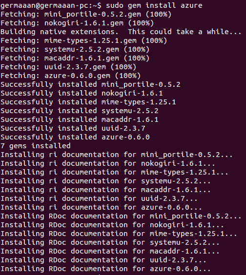

# Ejercicios 10:
### Desde un programa en Ruby o en algún otro lenguaje, listar los blobs que hay en un contenedor, crear un fichero con la lista de los mismos y subirla al propio contenedor. Muy meta todo.

Vamos a realizar el programa en **Ruby**, por lo que lo primero será instalar la gema de **Ruby** para **Azure**:

```
sudo gem install azure
```



Vamos a hacer un programa que obtenga todos los contenedores de nuestra cuenta y para cada uno genere un archivo de texto con una lista de los blobs que contiene. Una vez listados todos los blobs en ese archivo, el mismo es subido al propio contenedor. Básicamente debemos tener en cuenta lo siguiente del SDK de Azure para Ruby:

* **Azure::BlobService.new**: crea una interfaz para acceder al servicio de almacenamiento.
* **azure_blob_service.list_containers()**: lista los contenedores existentes en una cuenta de almacenamiento.
* **azure_blob_service.list_blobs(container.name)**: lista todos los blobs existentes en el contenedor indicado.

El código del programa es:

```
#!/usr/bin/ruby

require "azure"

puts "\nGENERADOR DE LISTADO DE BLOBS EN LOS CONTENEDORES"
puts "================================================="

azure_blob_service = Azure::BlobService.new
containers = azure_blob_service.list_containers()

containers.each do |container|
	name = container.name + ".txt"

	File.open(name, "w") do |list|

		list.puts container.name + ":"
		list.puts "=" * container.name.length

		blobs = azure_blob_service.list_blobs(container.name)

		blobs.each do |blob|
			list.puts "\t" + blob.name
		end
	end

	content = File.open(name, "rb") { |file| file.read }
	blob = azure_blob_service.create_block_blob(container.name, name, content)
	puts "\tSubido archivo " + blob.name
end

puts "\n"
```

En mi caso como tengo dos contenedores llamados **"conteimg"** y **"contemd"**, en ambos contenedores se han generado y almacenado los archivos **"[conteimg.txt](http://germaaan.blob.core.windows.net/conteimg/conteimg.txt)"** y **"[contemd.txt](http://germaaan.blob.core.windows.net/contemd/contemd.txt)"**
