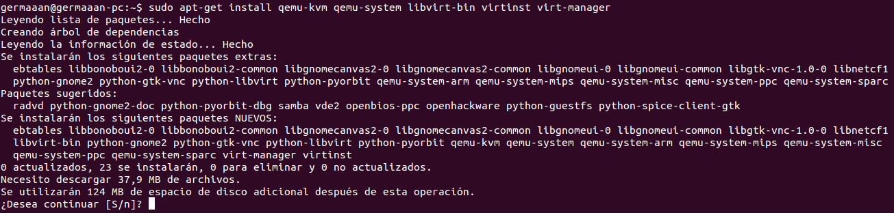

# Ejercicios 1:
### Instalar los paquetes necesarios para usar KVM. Se pueden [seguir estas instrucciones](https://wiki.debian.org/KVM#Installation). Ya lo hicimos [en el primer tema](http://jj.github.io/IV/documentos/temas/Intro_concepto_y_soporte_fisico), pero volver a comprobar si nuestro sistema está preparado para ejecutarlo o hay que conformarse con la paravirtualización.

Antes de instalar nada, comprobamos que nuestro procesador soporta virtualización introduciendo `egrep -c '(vmx|svm)' /proc/cpuinfo`, debemos obtener un valor que no sea "0". Ahora comprobamos si nuestro sistema está preparado para ejecutar VKM y no es necesario utilizar paravirtualización:

```
$ kvm-ok
INFO: /dev/kvm exists
KVM acceleration can be used
```

Una vez comprobado todo esto, instalamos los paquetes necesarios para usar **KVM** y algunos más que es recomendable instalar, serán: **qemu-kvm**, **libvirt-bin**, **virtinst** y **virt-manager**:

```
sudo apt-get install qemu-kvm qemu-system libvirt-bin virtinst virt-manager
```


