# Ejercicios 2:
### 1. Crear varias máquinas virtuales con algún sistema operativo libre, Linux o BSD. Si se quieren distribuciones que ocupen poco espacio con el objetivo principalmente de hacer pruebas se puede usar CoreOS (que sirve como soporte para Docker) GALPon Minino, hecha en Galicia para el mundo, Damn Small Linux, SliTaz (que cabe en 35 megas) y ttylinux (basado en línea de órdenes solo).

Antes de crear las máquinas virtuales vamos a activar el módulo del kernel de **VKM**:

```
sudo modprobe kvm-intel
```
Ahora vamos a realizar una instalación de **CoreOS**. Este sistema operativo ligero tiene una versión oficial preparada especialmente para **QEMU**, para realizar la instlación es necesario la imagen de disco (ya en format **QCOW2**) que puede ser descargado desde [aquí](http://storage.core-os.net/coreos/amd64-generic/dev-channel/coreos_production_qemu_image.img.bz2) junto con su [script de ejecución](http://storage.core-os.net/coreos/amd64-generic/dev-channel/coreos_production_qemu.sh):

```
wget http://storage.core-os.net/coreos/amd64-generic/dev-channel/coreos_production_qemu.sh
wget http://storage.core-os.net/coreos/amd64-generic/dev-channel/coreos_production_qemu_image.img.bz2
chmod +x coreos_production_qemu.sh
bunzip2 coreos_production_qemu_image.img.bz2
```

Para acceder a la maquina virtual es necesario usar llaves ssh, por lo que si no tenemos un par creado lo hacemos con `ssh-keygen`, el script de ejecución reconocerá directamente las llaves públicas almacenadas en el archivo por defecto (`~/.ssh/id_rsa.pub`). Para simplificar el acceso, editamos el archivo `~/.ssh/config` y añadimos las siguientes líneas:

```
Host coreos
HostName localhost
Port 2222
User core
StrictHostKeyChecking no
UserKnownHostsFile /dev/null
```

Solo nos queda arrancar la máquina virtual CoreOS con `./coreos_production_qemu.sh &` y acceder a ella introduciendo `ssh coreos`:

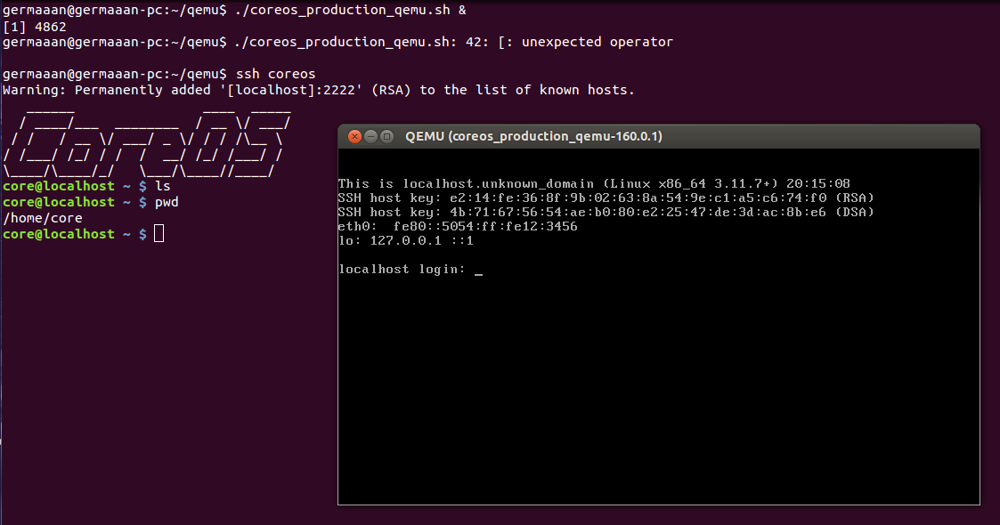

Hemos visto como se puede usar una máquina virtual, pero CoreOS venía ya preinstalado como tal, así que vamos a probar con **Damn Small Linux**, cuya imagen ISO podemos descargar desde [aquí](ftp://distro.ibiblio.org/pub/linux/distributions/damnsmall/current/dsl-4.4.10.iso), ocupando poco más de 50 MB.

```
wget ftp://distro.ibiblio.org/pub/linux/distributions/damnsmall/current/dsl-4.4.10.iso
qemu-img create -f qcow2 hdd-dsl.img 500M
qemu-system-x86_64 -hda ~/qemu/hdd-dsl.img -cdrom ~/qemu/dsl-4.4.10.iso
```

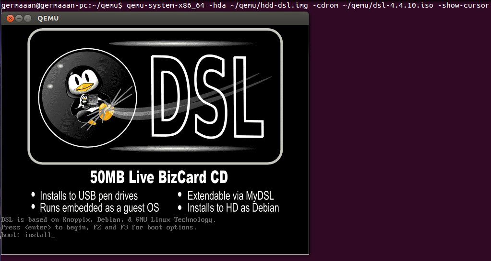

Por algún motivo, no funciona el ratón y no he podido encontrar la causa, así no he podido instalarlo correctamente en el disco duro virtual.


Vamos a probar a instalar un sistema más pesado, como es **Debian**, distribución en la que basan un gran cantidad de distribuciones GNU/Linux. Nos descargamos la ISO desde [aquí](http://gemmei.acc.umu.se/debian-cd/7.3.0/amd64/iso-cd/debian-7.3.0-amd64-CD-1.iso). Como la instalación en este caso se puede hacer mucho más pesada si dejamos las opciones de creación de máquina virtual por defecto (como por ejemplo la baja cantidad de memoria RAM), voy a realizar esta instalación trabajando con **KVM usando VMM**.

Aunque lo instalemos con VMM, creamos ahora el disco duro virtual para así asegurarnos que luego no vamos a tener problemas cuando queramos arrancarlo con QEMU (en este caso es necesario añadir `preallocation=metadata` para que VMM reconozca que es un archivo disperso y nos deje instalar en él el sistema operativo)

```
qemu-img create -f qcow2 -o preallocation=metadata hdd-debian.img 15G
```

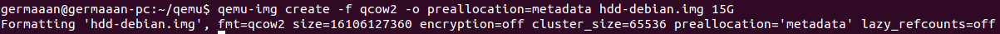

La creación de la máquina virtual con VMM es muy simple, simplemente deberemos indicarle las características del sistema a crear, como se hace en cualquier tipo de software de virtualización de sistemas operativos:

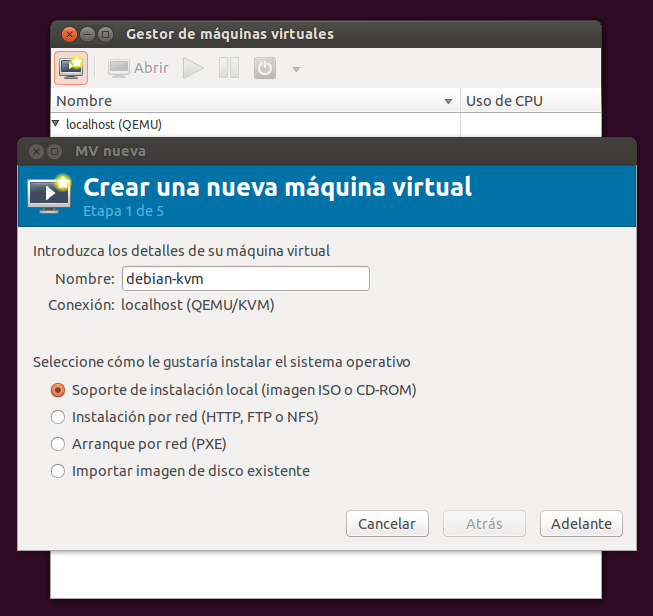

Simplemente deberemos ir indicando los mismos parámetros en los campos de la ventanas que indicariamos como parámetros desde línea de comandos, como la imagen ISO con la que realizar la instalación:

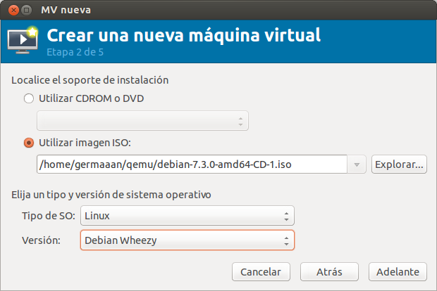

La cantidad de memoria RAM y número de procesadores:

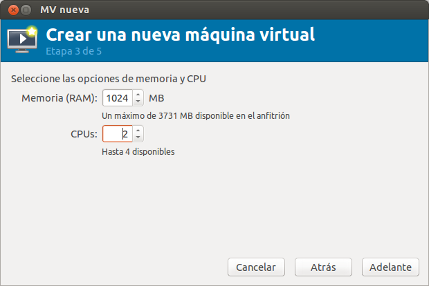

El disco duro virtual que vamos a usar para el almacenamiento (que podríamos crear directamente sino fuera porque ya lo creamos anteriormente):

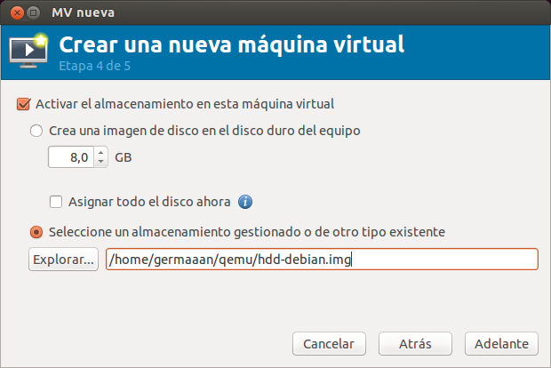

Una vez indicado todo, creamos la máquina virtual:


La arrancamos para iniciar la instalación:

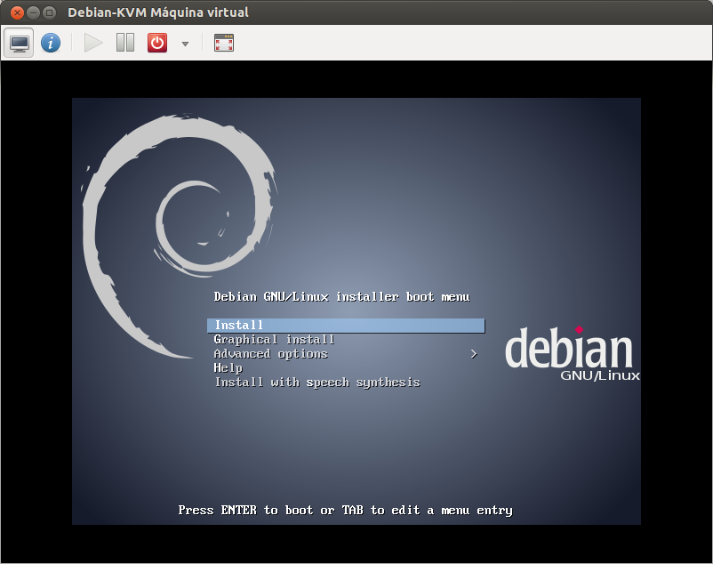

Y cuando finalice, ya tendremos nuestro sistema Debian funcionando bajo QEMU/KVM:

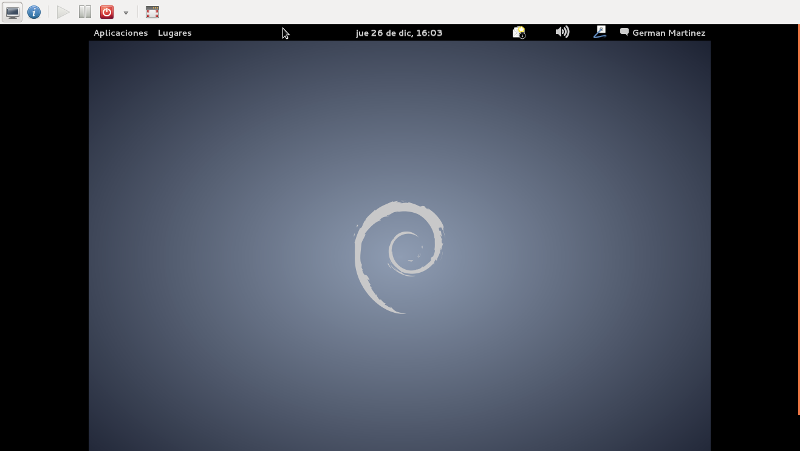

Una vez que ya esté instalada, cuando queramos arrancarla, podemos hacerla desde **VMM**, o usando **KVM con QEMU**. En este último caso, le tendremos que indicar donde esté el archivo del disco duro virtual; además podemos especificar comandos especiales como **virtio**, que es una paravirtualización de la entrada/salida que nos dará un acceso mucho más rápido al disco:

```
# Si la máquina virtual ha sido creada con VMM, para usar el archivo de disco duro virtual es necesario iniciar QEMU con permisos de administrador
sudo qemu-system-x86_64 -boot order=c -drive file=~/qemu/hdd-debian.img,if=virtio
```

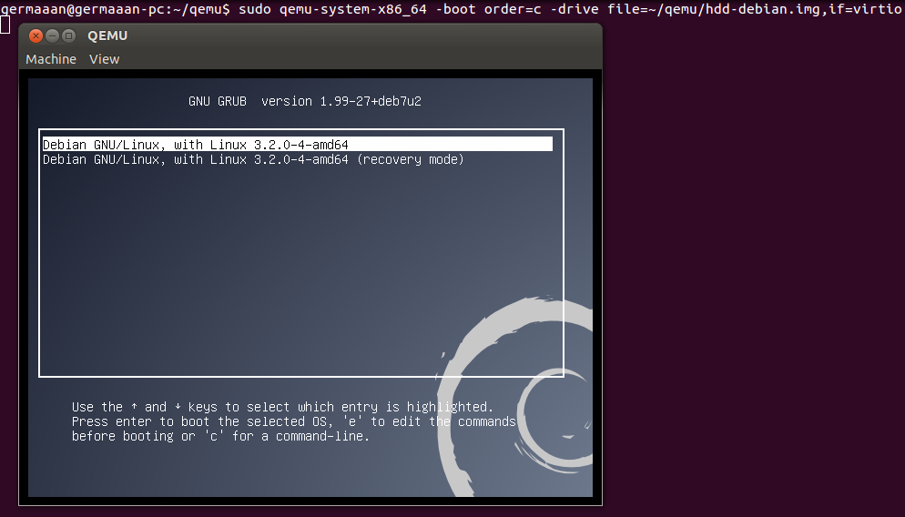

Debería arrancar, pero no arranca y no funciona el raton.

**Nota**: si QEMU indica en la barra de título que la máquina virtual está en estado **"Paused"** por el motivo que sea (en mi caso fue que el ordenador se quedó sin espacio en el disco duro), para reanudarla tenemos que acceder al monitor mediante la combinación de teclas **"Control + Alt + 2"** e introducir en el terminal **"cont"**. Pulsamos **"Control + Alt + 1"** para volver a la ejecución de la máquina virtual)

### 2. Hacer un ejercicio equivalente usando otro hipervisor como Xen, VirtualBox o Parallels.

Vamos a probar a crear una máquina virtual en VirtualBox por lo que primero vamos a instarlo:

```
sudo apt-get install virtualbox
```
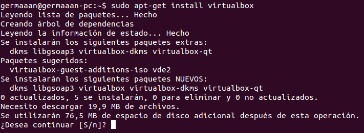

Por cambiar de sistemas operativo, en estas máquinas virtuales vamos a instalar **FreeBSD**, un sistemas operativo libre basado en BSD. Puede ser descargada en su versión 9.2 para 64 bits desde [aquí](ftp://ftp.freebsd.org/pub/FreeBSD/releases/amd64/amd64/ISO-IMAGES/9.2/FreeBSD-9.2-RELEASE-amd64-disc1.iso).

Crear una máquina virtual en VirtualBox es muy simple y parecido a crear una máquina en VMM, tenemos que ir introduciendo las características básicas de nuestro sistemas:

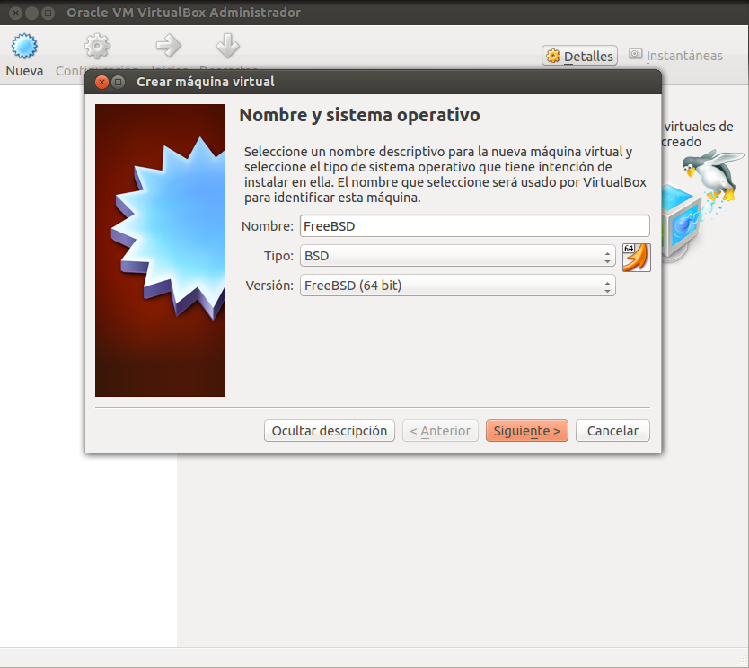

Como la memoria RAM:

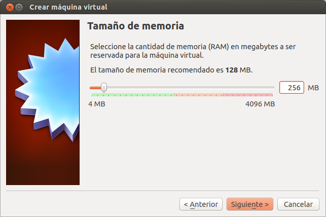

O la unidad de disco duro virtual, pudiendo crearla o seleccionar una ya previamente creada:

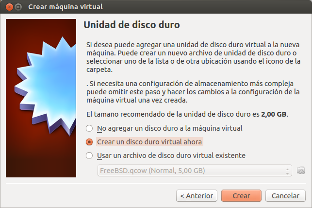

Voy a crear un disco duro virtual con formato QCOW para intentar luego arrancarlo con KDM:

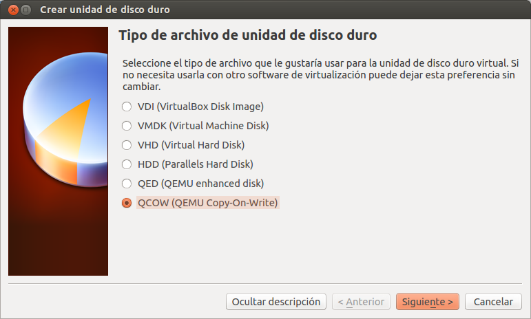

Solo hay que darle el tamaño que queramos:

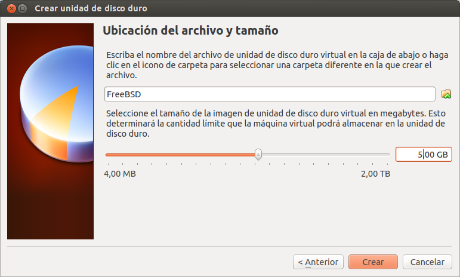

Ya con la máquina creada, y la ISO seleccionada, solo falta arrancarla:

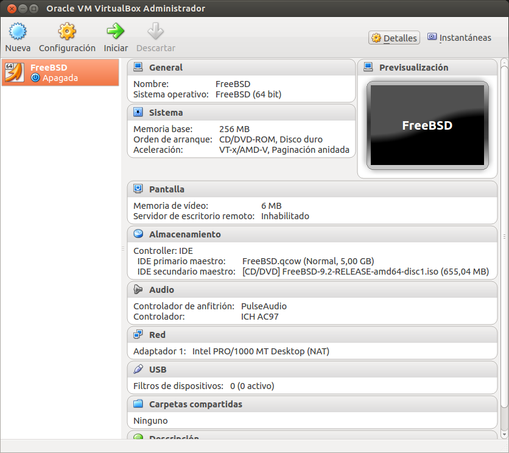

Para que se inicie y podamos realizar la instalación del sistemas operativo:

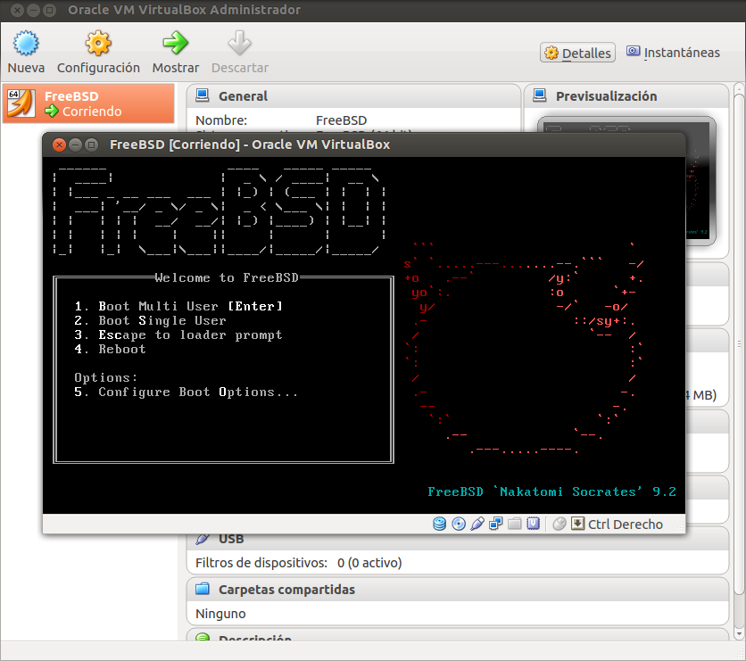

Y una vez finalizada la instalación, podemos comprobar que el sistema está instalado correctamente:

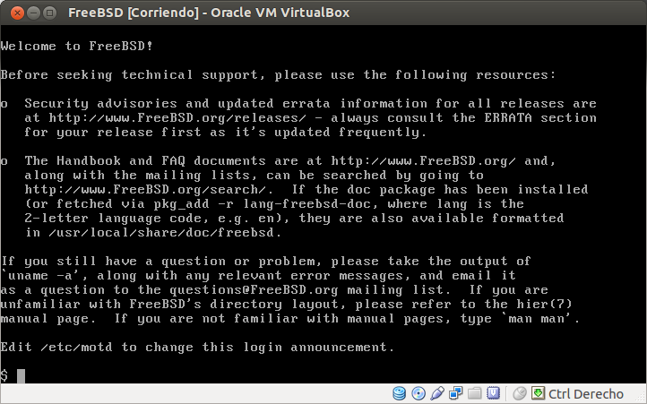

He probado arrancar desde el archivo de disco duro virtual de una máquina VirtualBox con KVM, y aunque arranca, da problemas durante el inicio del sistema operativo.
