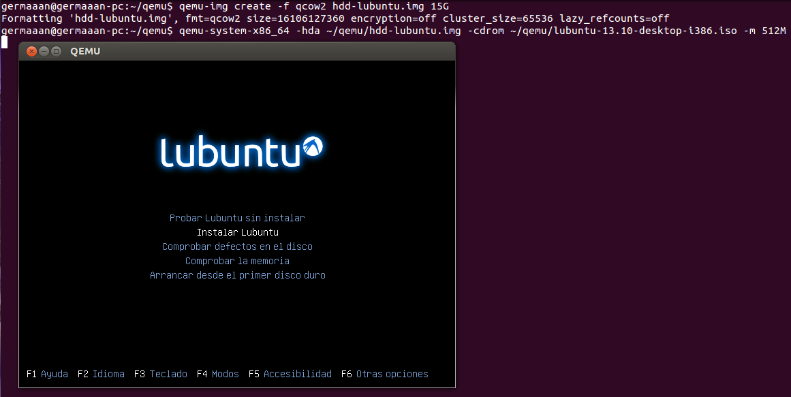
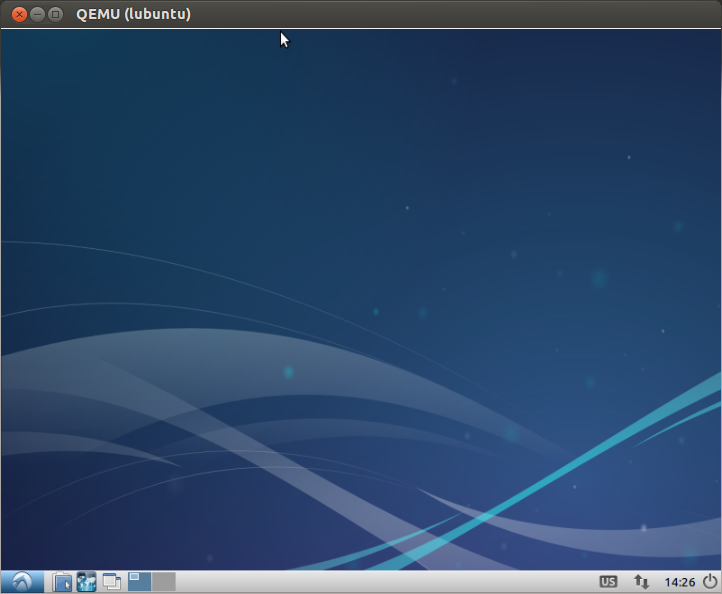
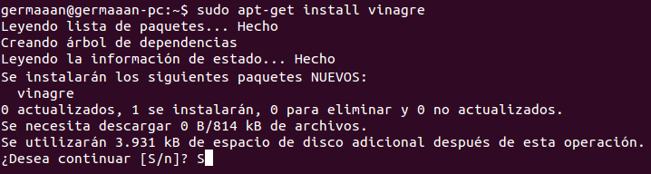
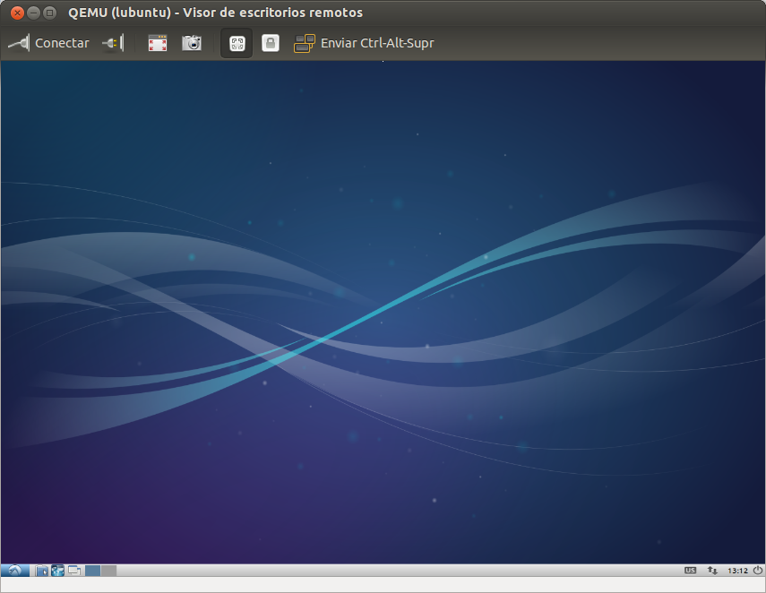
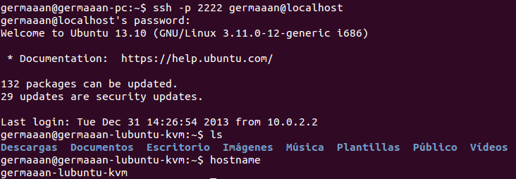

# Ejercicios 4:
### Crear una máquina virtual Linux con 512 megas de RAM y entorno gráfico LXDE a la que se pueda acceder mediante VNC y ssh.

Como queremos crear una máquina con un entorno gráfico **LXDE** voy a instalar **Lubuntu**, una distribución del proyecto Ubuntu que requiere menos recursos y usa dicho entorno gráfico. Dado los problemas que está produciendome virtualizar sistemas operativos de 64 bits con QEMU/KVM, voy a usar la versión de 32 bits que podemos descargar desde [aquí](http://cdimage.ubuntu.com/lubuntu/releases/13.10/release/lubuntu-13.10-desktop-i386.iso).

Al igual que en las otras máquinas virtuales que hemos ido creando, primero creamos el archivo que funcionará como disco duro virtual y después arrancamos la máquina virtual indicándole el archivo de disco duro virtual en el que instalarse, la imagen ISO que utilizar para la instalación y además, como así se requiere en este caso, indicamos que la cantidad de memoria RAM será 512 MB (`-m 512M`):

```
qemu-img create -f qcow2 hdd-lubuntu.img 15G
qemu-system-x86_64 -hda ~/qemu/hdd-lubuntu.img -cdrom ~/qemu/lubuntu-13.10-desktop-i386.iso -m 512M
```



Comprobamos que el sistema se ha instalado correctamente arrancándola normalmente:

```
qemu-system-x86_64 -boot order=c -drive file=~/qemu/hdd-lubuntu.img,if=virtio -m 512M -name lubuntu
```



Paramos la ejecución de la máquina virtual y la volvemos a arrancar, pero indicando que vamos a arrancarla dentro de un servidor **VNC** (`-vnc :1`). Indicaderemos un nombre para la máquina que nos ayude a identificarla más fácilmente (`-name lubuntu`):

```
qemu-system-x86_64 -boot order=c -drive file=~/qemu/hdd-lubuntu.img,if=virtio -m 512M -name lubuntu -vnc :1
```

Para conectarnos a la máquina necesitaremos un cliente VNC, así que voy a instalar **vinagre**:

```
sudo apt-get install vinagre
```



Antes de conectarnos a la máquina virtual tenemos que conocer la dirección de la **interfaz NAT** que provee de acceso al exterior a **KVM**, la interfaz **"virbr0"**, en mi caso su dirección es **192.168.122.1** (`ifconfig virbr0`).


Y nos conectamos a la máquina virtual mediante `vinagre 192.168.122.1:5901 &`:



Ahora queremos conectarnos mediante **SSH**, aunque primero tenemos que aclarar como funciona la interconexión de redes entre KVM/QEMU y el sistema anfitrión. A no ser que indiquemos lo contrario, QEMU por defecto emula una tarjeta de red simple que hace de puente a través de la interfaz **"virbr0"** hacía la conexión de red del anfitrión, permitiéndonos el acceso a los recursos de red (como **Internet**), pero a la vez funcionando como un sistema firewall que no permite cualquier tráfico entrante. Además de todo esto, los únicos protocolos soportados son **TCP** y **UDP**, por lo que si pensamos en comprobar si hay conexión entre ambos sistemas mediante un **ping** (protocolo **ICMP**), podemos llevarnos la errónea idea de que no hay conexión entre la máquina virtual y el host anfitrión.

Teniendo en cuenta lo anterior, para permitir conexiones de red al sistema de la máquina virtual tenemos que redirigir un puerto en el sistema anfitrión a un puerto en el sistema virtual. En caso de **SSH**, el puerto usado es el **22**, así que vamos a tomar por ejemplo el puerto **TCP 2222** del sistema anfitrión y lo vamos a redirigir al puerto del sistema virtual **22**. Para hacer esto tenemos que añadir el argumento `-redir tcp:2222::22`.

```
qemu-system-x86_64 -boot order=c -drive file=~/qemu/hdd-lubuntu.img,if=virtio -m 512M -name lubuntu -redir tcp:2222::22
```

Ahora, simplemente conectándonos por SSH al puerto 2222 de nuestro host local, estaremos conectándonos al puerto 22 de nuestro host virtual:

```
ssh -p 2222 germaaan@localhost
```


