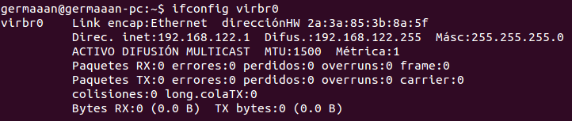

# Ejercicios 4:
### Crear una máquina virtual Linux con 512 megas de RAM y entorno gráfico LXDE a la que se pueda acceder mediante VNC y ssh.

Como queremos crear una máquina con un entorno gráfico **LXDE** voy a instalar **Lubuntu**, una distribución del proyecto Ubuntu que requiere menos recursos y usa dicho entorno gráfico. Dado los problemas que está produciendome virtualizar sistemas operativos de 64 bits con QEMU/KVM, voy a usar la versión de 32 bits que podemos descargar desde [aquí](http://cdimage.ubuntu.com/lubuntu/releases/13.10/release/lubuntu-13.10-desktop-i386.iso).

Al igual que en las otras máquinas virtuales que hemos ido creando, primero creamos el archivo que funcionará como disco duro virtual y después arrancamos la máquina virtual indicándole el archivo de disco duro virtual en el que instalarse, la imagen ISO que utilizar para la instalación y además, como así se requiere en este caso, indicamos que la cantidad de memoria RAM será 512 MB (`-m 512M`):

```
qemu-img create -f qcow2 hdd-lubuntu.img 15G
qemu-system-x86_64 -hda ~/qemu/hdd-lubuntu.img -cdrom ~/qemu/lubuntu-13.10-desktop-i386.iso -m 512M
```


Comprobamos que el sistema se ha instalado correctamente arrancándola normalmente:

```
qemu-system-x86_64 -boot order=c -drive file=~/qemu/hdd-lubuntu.img,if=virtio -m 512M -name lubuntu
```


Paramos la ejecución de la máquina virtual y la volvemos a arrancar, pero indicando que vamos a arrancarla dentro de un servidor VNC (`-vnc :1`). Para simplificar indicaderemos un nombre para la máquina que también podremos usar para conectarnos mediante VNC (`-name lubuntu`):

```
qemu-system-x86_64 -boot order=c -drive file=~/qemu/hdd-lubuntu.img,if=virtio -m 512M -name lubuntu -vnc :1
```

Para conectarnos a la máquina necesitaremos un cliente VNC, si tenemos instalado Ubuntu como sistema operativo anfitrión, así que voy a instalar **vinagre**:

```
sudo apt-get install vinagre
```


Y nos conectamos a la máquina virtual mediante `vinagre lubuntu:5901 &`, pero nos nuestra un error **"Conexión cerrada. Se cerró la conexión con el equipo lubuntu::5901."**


