# Ejercicios 5:
### Crear una máquina virtual Ubuntu e instalar en ella un servidor nginx para poder acceder mediante web.

Vamos a crear una máquina virtual en nuestra cuenta de Azure, la máquina virtual estará basada en una de las imágenes disponibles en dicha plataforma, por lo que primero vamos a listar todas las imágenes disponibles:

```
azure vm image list
```

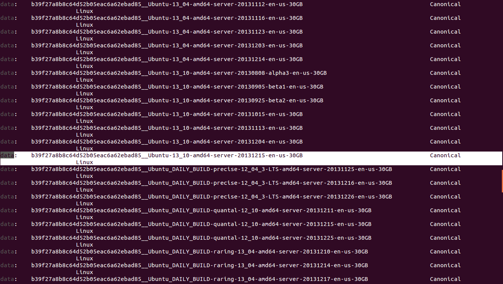

De entre todo el listado de imágenes nos interesa una que pertenezca a Ubuntu, por lo que vamos a elegir **"b39f27a8b8c64d52b05eac6a62ebad85__Ubuntu-13_10-amd64-server-20131215-en-us-30GB"** que pertenece a un **Ubuntu Server 13.10 de 64 bits**. Para conocer los detalles de esta imagen introducimos:

```
azure vm image show b39f27a8b8c64d52b05eac6a62ebad85__Ubuntu-13_10-amd64-server-20131215-en-us-30GB
```

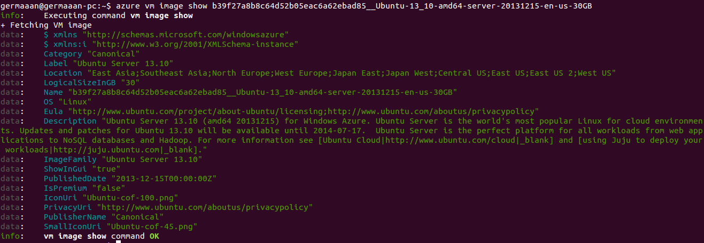

Procedemos con la creación de una máquina virtual a la que le damos un nombre (**germaaanbuntu**), indicamos la imagen a instalar (**azure vm create germaaanbuntu b39f27a8b8c64d52b05eac6a62ebad85__Ubuntu-13_10-amd64-server-20131215-en-us-30GB**), el nombre de usuario que además en esta máquina tendrá permisos de superusuario (**germaaan**), la contraseña del usuario (con una longitud de 8 caracteres, letras minúsculas, letras mayúsculas, números y al menos un caracter "especial"), la localización del servidor físico donde se almacenará (**--location "West Europe"** en nuestro caso por razones de seguridad) y que se pueda acceder mediante SSH (**--ssh**):

```
azure vm create germaaanbuntu b39f27a8b8c64d52b05eac6a62ebad85__Ubuntu-13_10-amd64-server-20131215-en-us-30GB germaaan PASSWORD --location "West Europe" --ssh
```

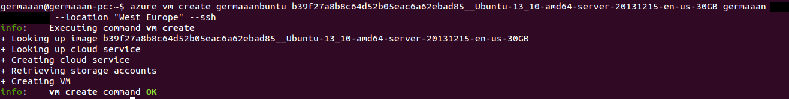

Una vez que haya terminar de crearse la máquina virtual, aparecerá en nuestro listado de máquinas virtuales:

```
azure vm list
```

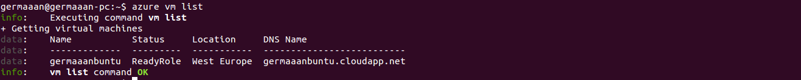

Así que solo queda arrancarla:

```
azure vm start germaaanbuntu
```

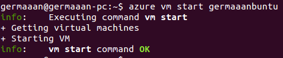

Como indicamos la opción de acceso mediante SSH, podremos acceder mediante realizando una conexión SSH indicando nuestro nombre de usuario y contraseña:

```
ssh germaaan@germaaanbuntu.cloudapp.net
```

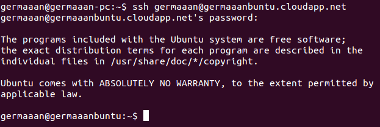

Pero por comodidad vamos a crear un par de llaves pública/privada para poder acceder directamente a nuestra máquina virtual en la nube desde nuestro ordenador sin tener que introducir una contraseña que ya hemos indicado que tiene que tener cierta complejidad. Así que en la máquina virtual creamos las claves SSH con `ssh-keygen -t rsa` y en el interior del archivo **"~/.ssh/authorized_keys"** copiamos el contenido de nuestra clave que se encuentra en el archivo **"~/.ssh/id_rsa.pub local"** (si no lo tenemos lo creamos igualmente con `ssh-keygen -t rsa`). Ya podemos acceder directamente a nuestra máquina virtual:

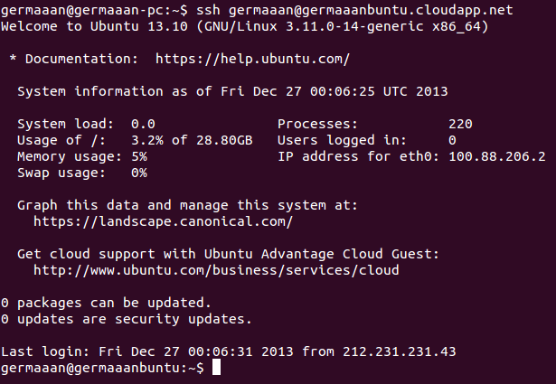

Lo primero que deberiamos hacer por motivos de seguridad es actualizar los paquetes de nuestra máquina virtual, así que actualizamos la lista de paquetes:

```
sudo apt-get update
```

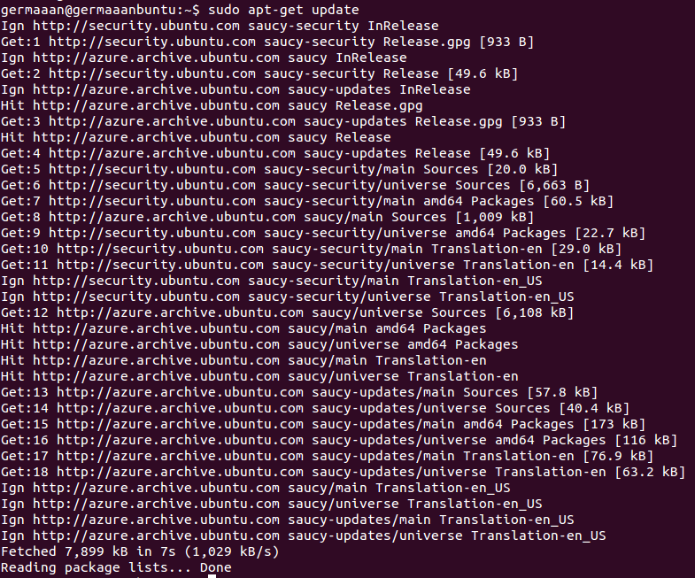

Y aplicamos la actualizaciones existentes:

```
sudo apt-get upgrade
```

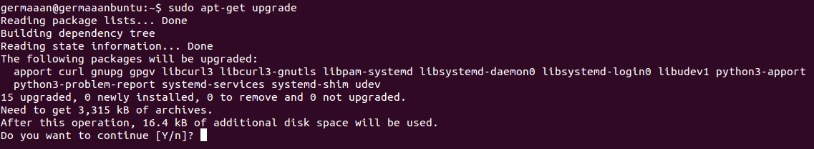

Ahora ya instalamos **Nginx" para poder acceder vía web a nuestra máquina virtual:

```
sudo apt-get install nginx
```

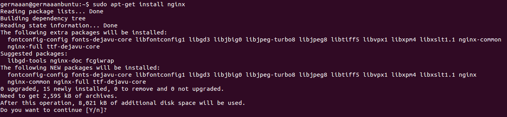

Vamos a moficiar la página de índice por defecto de Nginx para que muestre un mensaje personalizado, para lo que tenemos que modificar el archivo **"/usr/share/nginx/html/index.html"**. Seguramente Nginx esté parado, en cualquier caso podemos comprobar y arrancarlo:

```
sudo service nginx status
sudo service nginx start
```

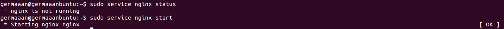

El servidor ya está funcionando, pero no estará accesible hasta que indiquemos un **extremo** a la máquina virtual, así que tenemos que crear un extremo que mediante protocolo **TCP** se conecte al puerto **80** para que los navegadores puedan acceder a el.

```
azure vm endpoint create -n http germaaanbuntu 80 80
azure vm endpoint list germaaanbuntu
```

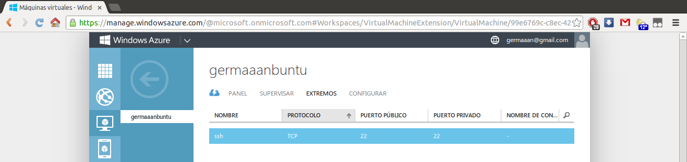

Así que solo nos queda comprobar que la dirección [http://germaaanbuntu.cloudapp.net](http://germaaanbuntu.cloudapp.net) es accesible y muestra nuestra página de inicio personalizada. Si la dirección no está accesible seguramente se deba a que he tenido que apagar la máquina virtual por necesitarla para otro ejercicio y tener que cumplir con las restricciones de nuestras cuentas de Azure.

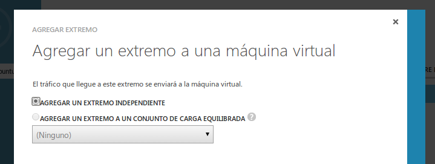
