# Ejercicios 6:
### Usar juju para hacer el ejercicio anterior.

Como seguramente después de utilizarlo para los ejercicios del tema 3, desinstalamos **Juju** por todos los problemas que nos dio, volvemos a instalarlo siguiendo los mismos pasos que el para el [ejercicio 6](https://github.com/germaaan/IV_GMM/blob/master/TEMA3/ejercicio06.md) de dicho tema, a no ser que vayamos a trabajar en local no es necesario instalar **MongoDB**. Además, también deberemos tener instalar **LXC**, por lo que si lo desinstalamos se instala como en el [ejercicio 1](https://github.com/germaaan/IV_GMM/blob/master/TEMA3/ejercicio01.md) del mismo tema también.

Después de instalar Juju, vamos a configurarlo para Windows Azure, en el archivo de configuración **~/.juju/environments.yaml** (da igual que lo hayamos generado con `sudo juju init` o con `sudo juju generate-config`) hay una sección correspondiente a Azure (comenzando con **azure:**), en este sección tendremos que introducir nuestros propios valores para **management-subscription-id**, **management-certificate-path** y **storage-account-name** como haremos más adelante.

Primero, generamos un nuevo certificado para el uso de juju:

```
openssl req -x509 -nodes -days 3650 -newkey rsa:2048 -keyout azure.pem -out azure.pem
openssl x509 -inform pem -in azure.pem -outform der -out azure.cer
chmod 600 azure.pem
```

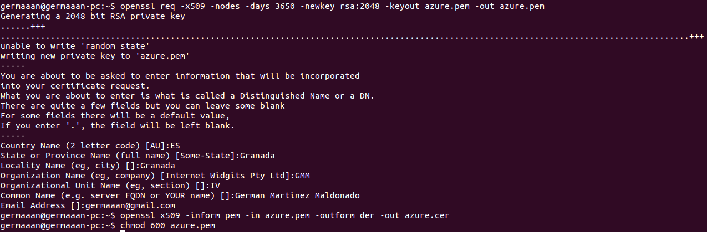

Para conocer el identificador de suscripción usamos `azure account list`, el valor del campo **"Id"** será el que tengamos que darle a **management-subscription-id**. 

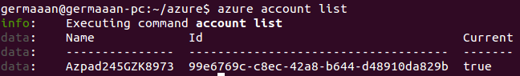

Para subir el certificado que hemos generado, como mediante linea de comandos no encuentro la opción, desde la página de Windows Azure, accedemos a la sección **"CONFIGURACIÓN"** y una vez dentro a "**"CERTIFICADOS DE ADMINISTRACIÓN"**, pulsamos el botón de la parte inferior **"CARGAR"** y seleccionamos el nuestro archivo **"azure.cer"**. Este será el archivo que tenemos que indicar en **management-certificate-path**.

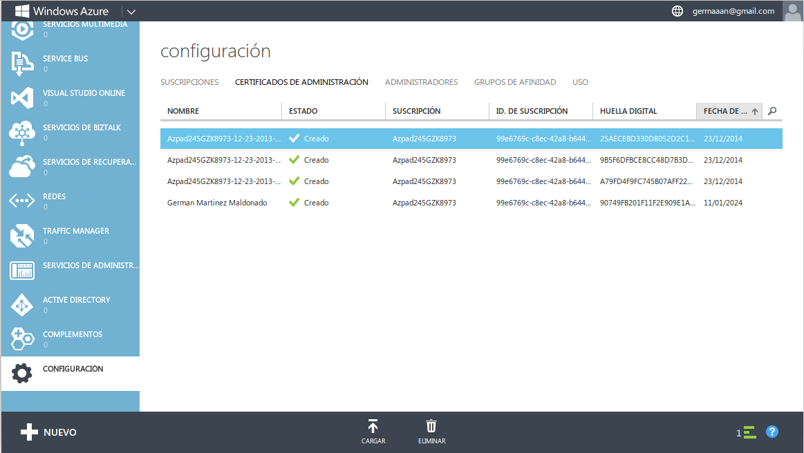

Como ya creamos la cuenta de almacenamiento en el [ejercicio 8](https://github.com/germaaan/IV_GMM/blob/master/TEMA4/ejercicio08.md) del tema anterior, en vez crear una cuenta de almacenamiento, simplemente con `azure account storage list` vamos a listar las que tenemos para darle el valor del campo **"name"** a **storage-account-name**.

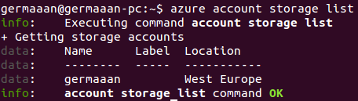

Así que editamos el archivo **~/.juju/environments.yaml** introduciendo los valores indicados, además tenemos que cambiar el valor de **location** por la localización donde hayamos creado nuestra cuenta de almacenamiento.


Ya con la configuración realizada, creamos un táper para instalar los servicios dentro de él e instalamos el GUI simplemente desplegando y exponiendo el encanto correspondiente como haríamos con cualquier otro. (**Nota**: es necesario desplegar el encanto en la máquina 0 para evitar que juju intente crear otra máquina para instalar en ella el GUI, porque debido a las limitaciones de nuestra suscripción de prueba, no podemos crear más de 2 máquinas virtuales, así que como es muy posibe que tengamos ya alguna otra máquina creada en Azure, al intentar hacer esto obtendríamos un error que haría que el servicio instalado nunca termine de iniciarse).

```
sudo juju switch azure
sudo juju bootstrap
sudo juju deploy --to 0 juju-gui
sudo juju expose juju-gui
sudo juju status
```

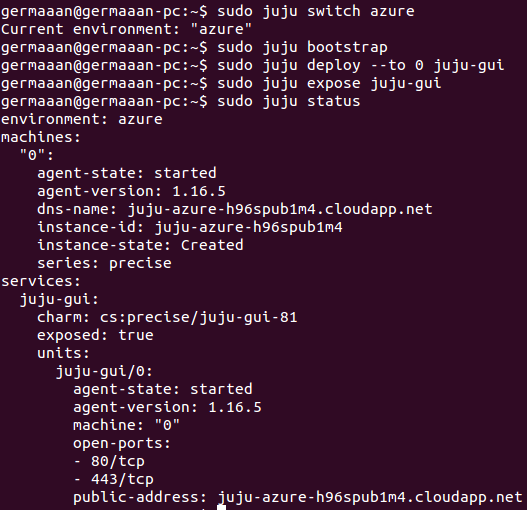

Una vez esté listo podemos acceder a él desde el navegador mediante la dirección [juju-azure-h96spub1m4.cloudapp.net](http://juju-azure-h96spub1m4.cloudapp.net). El la contraseña para acceder como el usuario **"user-admin"** es el valor de **"admin-secret"** en el archivo de configuración **"~/.juju/environments.yaml"**.

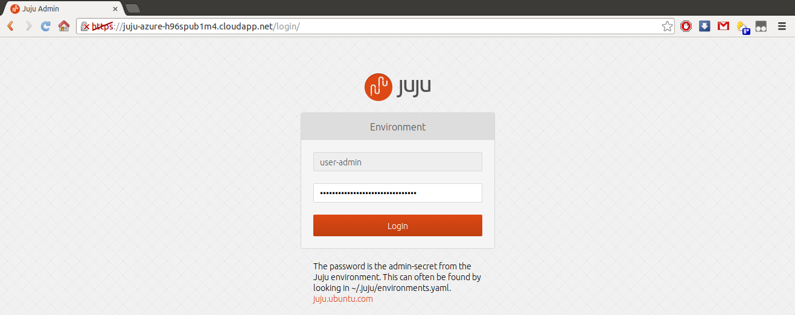

Una vez dentro, Juju GUI luce como se ve en la siguiente imagen:

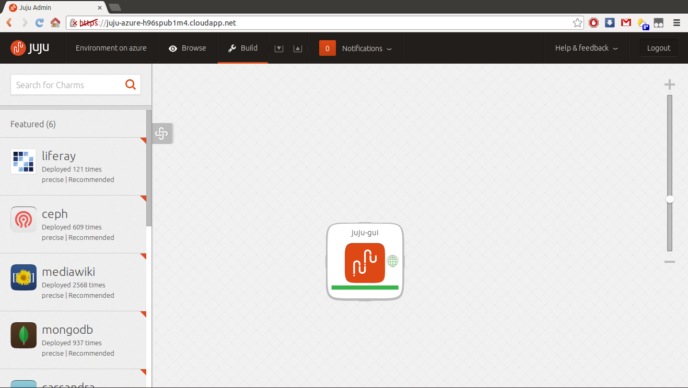

Ahora para instalar **nginx**, simplemente deberemos introducir su nombre en el buscador de arriba a la izquierda, y nos aparecerá para añadirlo directamente a nuestro panel:

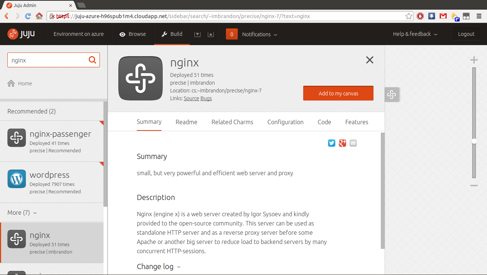

Una vez que este en nuestro panel simplemente deberemos introducir sus parámetros de configuración y pulsas el botón **"Deploy"**.

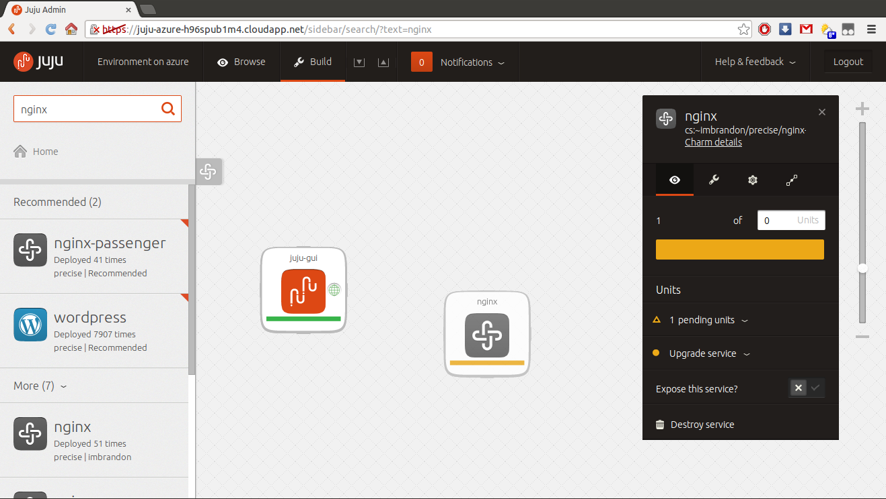

El problema está en que esto intentará crear una nueva máquina virtual, lo que es imposible con nuestra suscripción a Azure, así que si queremos instalarlo de forma que el servicio se pueda iniciar (como vemos en la imagen anterior, el color en la figura de nginx es amarillo que significa pendiente, y por el problema mencionado, nunca pasara a color verde que significa ejecutando, como está juju-gui) deberemos desplegarlo desde un terminal mediante `sudo juju deploy --to 0 cs:~imbrandon/precise/nginx`.

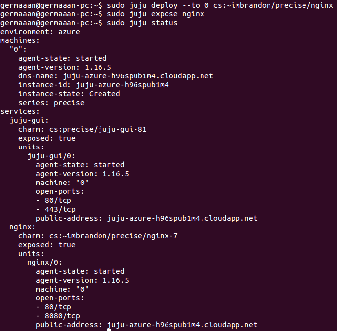

Si accedemos otra vez a [juju-azure-h96spub1m4.cloudapp.net](http://juju-azure-h96spub1m4.cloudapp.net), vemos que ahora nginx aparece en verde, por lo que ya está en ejecución, como también indicado `sudo juju status`.

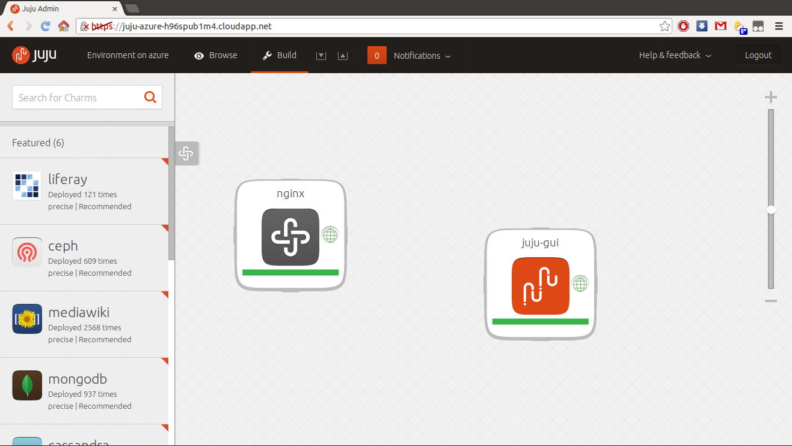

Ya simplemente faltaría configurar nginx dentro de juju para que sea accesible mediante web.
