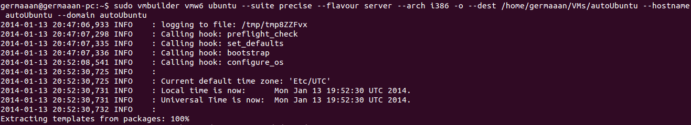
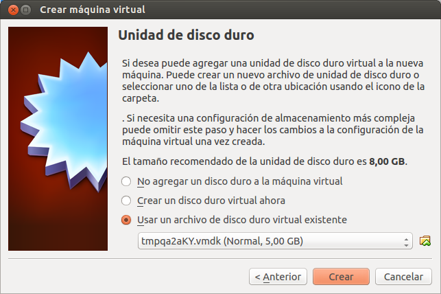
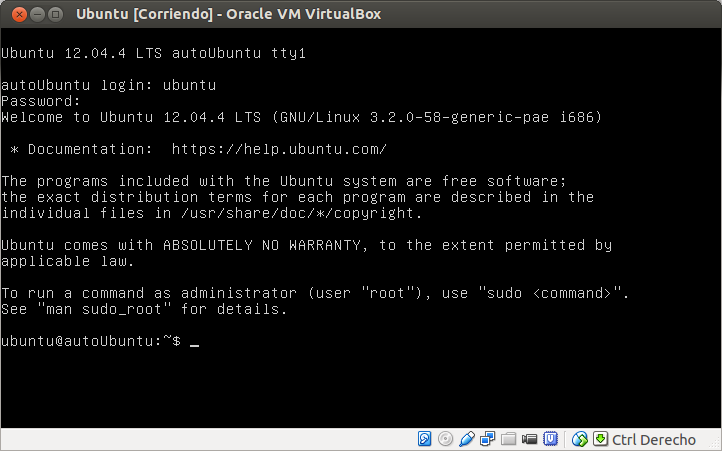

# Ejercicios 7:
### Instalar una máquina virtual Ubuntu 12.04 para el hipervisor que tengas instalado.

Queremos realizar la instalación de una máquina virtual de forma automática, provisionarla. Para ello primero tenemos que instalar una serie de paquetes:

```
sudo apt-get install ubuntu-vm-builder kvm virt-manager
```


Ahora para provisionar la máquina virtual simplemente es necesario introducir la línea de ordenes de **vmbuilder** con los siguientes parámetros:

* **vmw6**: crear una imagen virtual en formato VMWare (que luego vamos a probar en VirtualBox)
* **ubuntu --suite precise**: instalar una versión básica de Ubuntu 12.04 (Precise Pangolin) dentro de la imagen virtual
* **--flavour server**: la versión a instalar es la servidor
* **--arch i386**: para una arquitectura de 32 bits
* **-o**: sobrescribiendo el contenido de la imagen si existe
* **--dest /home/germaaan/VMs/autoUbuntu**: en el directorio indicado
* **--hostname autoUbuntu**: con nombre de la máquina autoUbuntu
* **--domain autoUbuntu**: nombre de dominio autoUbuntu (si no hubiera problemas se podría usar para acceder desde virt-manager)

´´´
sudo vmbuilder vmw6 ubuntu --suite precise --flavour server --arch i386 -o --dest /home/germaaan/VMs/autoUbuntu --hostname autoUbuntu --domain autoUbuntu
´´´



Ahora abrimos VirtualBox y creamos una nueva máquina virtual, pero cuando nos de la opción de agregar una unidad de disco duro virtual seleccionamos el archivo que se ha creado en el directorio indicado.



Y arrancamos la máquina virtual para comprobar que funciona correctamente y que podemos acceder introduciendo como usuario y contraseña la palabra **"ubuntu"**.


