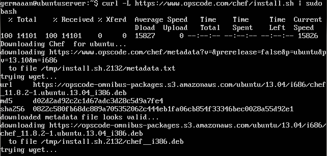
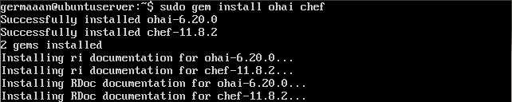
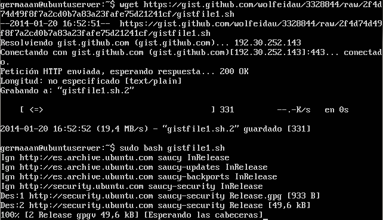
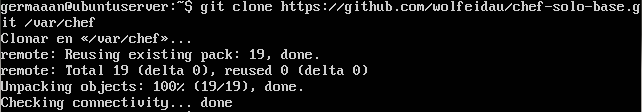
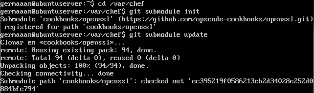
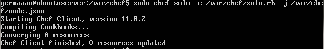

# Ejercicios 1:
### Instalar chef en la máquina virtual que vayamos a usar.

Primero hay que instalar **Ruby** y **Ruby Gems** en la máquina virtual.

```
sudo apt-get install ruby1.9.1 ruby1.9.1-dev rubygems
```



Ahora instalamos **chef** como una gema de Ruby, también instalamos de la misma manera **ohai** como complemento de chef.

```
sudo gem install ohai chef
```



Si queremos instalar **chef-solo** podemos usar [este Gist](https://gist.github.com/wolfeidau/3328844/raw/2f4d74d49f8f7a2cd0b7a83a23fafe75d21241cf/gistfile1.sh).

```
wget https://gist.github.com/wolfeidau/3328844/raw/2f4d74d49f8f7a2cd0b7a83a23fafe75d21241cf/gistfile1.sh
sudo bash gistfile1.sh
```



Creamos el directorio de chef-solo y le damos la propiedad al usuario que vaya a ejecutarlo.

```
sudo mkdir /var/chef
sudo chown germaaan:germaaan /var/chef
```


Clonamos el proyecto git con la base de chef-solo en el directorio que hemos creado para instalarlo.

```
git clone https://github.com/wolfeidau/chef-solo-base.git /var/chef
```



Inicializamos los submodulos y los actualizamos.

```
cd /var/chef
git submodule init
git submodule update
```



Comprobamos que chef-solo funciona correctamente.

```
sudo chef-solo -c /var/chef/solo.rb -j /var/chef/node.json
```


