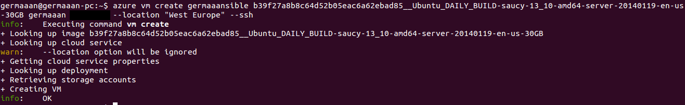
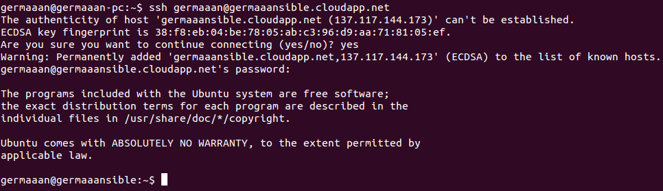
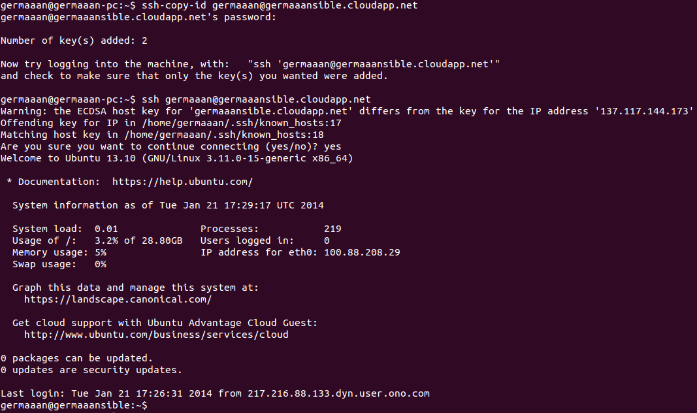
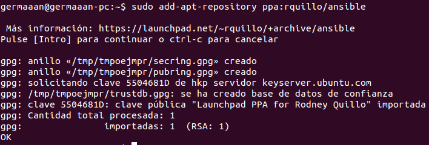
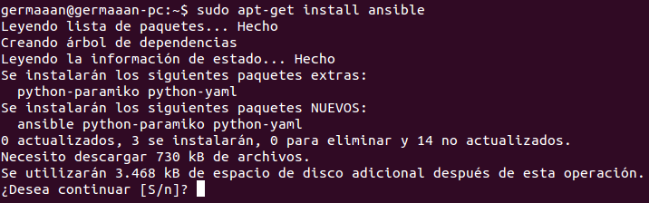
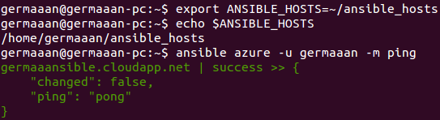
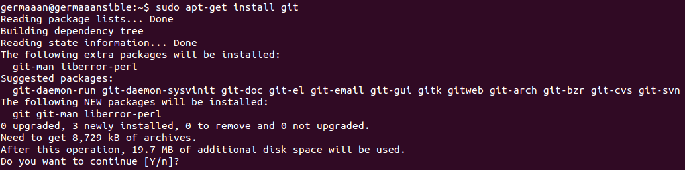
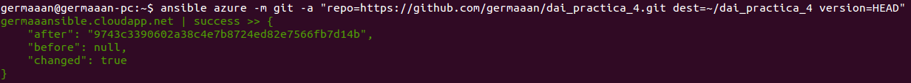
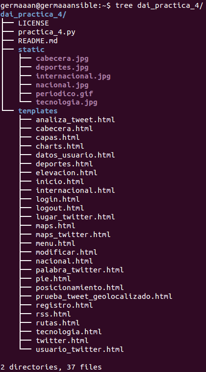

# Ejercicios 4:
### Desplegar los fuentes de la aplicación de DAI o cualquier otra aplicación que se encuentre en un servidor git público en la máquina virtual Azure (o una máquina virtual local) usando ansible.

Lo primero es crear una máquina virtual en Azure de igual forma que ya creamos anteriormente, en este caso voy a llamar a la máquina ["germaaansible"](http://germaaansible.cloudapp.net/).

```
azure vm create germaaansible b39f27a8b8c64d52b05eac6a62ebad85__Ubuntu_DAILY_BUILD-saucy-13_10-amd64-server-20140119-en-us-30GB germaaan PASSWORD --location "West Europe" --ssh
```



Ahora nos aseguraremos que tenemos acceso mediante SSH a la máquina virtual (las máquinas de Azure ya tienen el paquete `openssh-server` así que no es necesario instalarlo).

```
ssh germaaan@germaaansible.cloudapp.net
```



Para poder acceder directamente al servidor Azure sin tener que introducir la contraseña de usuario copiamos en él nuestro archivo de clave pública (generado con `ssh-keygen -t rsa -C "germaaan@gmail.com"`), y volvemos a intentar acceder, ahora no nos pedirá contraseña.

```
ssh-copy-id germaaan@germaaansible.cloudapp.net
ssh germaaan@germaaansible.cloudapp.net
```



Con Ansible vamos a poder ejecutar configuraciones en ordenadores remotos, así para hacer un ejemplo de su funcionamiento voy a instalarlo en mi propio sistema local. Puede ser instalado como un módulo de Python o como una aplicación normal, en este voy hacerlo de esta segunda forma. Para eso primero tenemos que añadir su repositorio correspondiente.

```
sudo add-apt-repository ppa:rquillo/ansible
```



Ya solo nos queda actualizar la lista de paquetes e instalar **ansible**.

```
sudo apt-get update
sudo apt-get install ansible
```



Antes de poder usar Ansible, tenemos que crear un fichero inventario con todas las máquinas controladas por la máquina anfitriona (indicando la dirección de cada una de las máquinas), dicho archivo lo voy a crear con el nombre **"ansible_hosts"** y lo situo en la carpeta personal **"~/"**. Como la ruta por defecto de este archivo es **/etc/ansible/hosts**, cambiaré el valor de la variable **"ANSIBLE_HOSTS"** indicando el camino al nuevo archivo de configuración. Para comprobar que todo funciona correctamente haremos un **ping** a la máquina virtual con **ansible**.

* **ansible_hosts**:

```
[azure]
germaaansible.cloudapp.net
```

```
export ANSIBLE_HOSTS=~/ansible_hosts
echo $ANSIBLE_HOSTS
ansible azure -u germaaan -m ping     // No necesito la opción `--ask-pass`, configurado el acceso sin contraseña
```



Aunque vayamos a desplegar la aplicación usando **ansible**, este solo se encarga de la configuración, pero **git** tiene que estar instalado en la máquina remota, así que sin más lo instalamos.

```
sudo apt-get install git
```



La aplicación está en este [repositorio](https://github.com/germaaan/dai_practica_4), así que para finalizar, otra vez desde nuestro máquina anfitriona local damos la orden para que usando **ansible** despleguemos los fuentes de la aplicación.

```
ansible azure -m git -a "repo=https://github.com/germaaan/dai_practica_4.git dest=~/dai_practica_4 version=HEAD"
// Me ahorro la opción `-u germaaan` porque el nombre de usuario es el mismo en ambas máquinas
```



Solo nos queda volver a acceder a la máquina remota para comprobar que los fuentes han sido desplegados correctamente.


