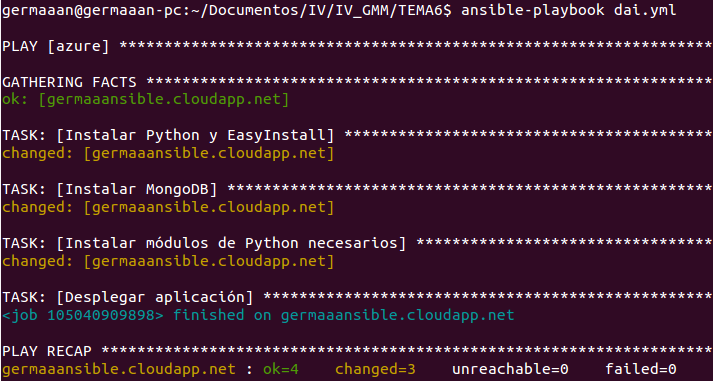
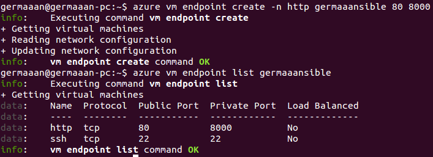
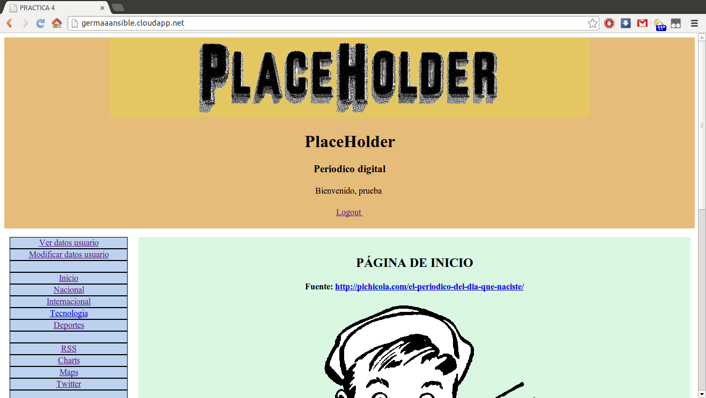

# Ejercicios 5:
### Desplegar la aplicación de DAI con todos los módulos necesarios usando un playbook de Ansible.

Una vez que ya tenemos los fuentes de la aplicación en nuestro servidor, lo único que resta es desplegar dicha aplicación, para ello usaremos un playbook de Ansible. La aplicación está en realizada en Python y usa diversos módulos, por lo que antes de ejecutar la aplicación deberemos instalar el propio **Python** y el paquete **EasyInstall** para instalar los módulos (no he instalado **pip** porque daba errores en la ejecución). Además, como base de datos instalaremos **MongoDB**.

Como tendrá que atender conexiones con los clientes que se conectan a la misma y conexiones a la base de datos de los mismos, las conexiones deberán permanecer abiertas hasta que la tarea se realice, por lo que deberemos establecer que la aplicación funcione en modo asíncrono con una duración relativamente larga (en este caso, **async: 50**, porque si el valor de tiempo de ejecución máximo es inferior a 50, secciones como la de Twitter o Google Maps comienzan a dar problemas). Como no es necesario que la conexión espere hasta que la tarea se complete, indicamos un valor de sondeo de finalización es 0 (**poll: 0**).

* **Playbook "dai.yml"**

```
---
- hosts: azure
  sudo: yes
  tasks:
    - name: Instalar Python y EasyInstall
      apt: name=build-essential state=present
      apt: name=python-dev state=present
      apt: name=python-setuptools state=present
    - name: Instalar MongoDB
      apt: name=mongodb-server state=present
    - name: Instalar módulos de Python necesarios
      command: easy_install web.py mako pymongo feedparser tweepy geopy
    - name: Desplegar aplicación
      command: chdir=/home/germaaan/dai_practica_4 python practica_4.py 8080 &
      async: 50
      poll: 0
```

```
ansible-playbook dai.yml
```



Otro problema surgido ha sido con los puertos, la aplicación daba error si la establecíaa en el puerto 80, así que en la ejecución indico que se escuche el puerto 8080, y luego en la configuración de la máquina de Azure añado un **extremo HTTP** a la máquina virtual del **protocolo TCP** que permita conectarse mediante el **puerto público 80** (el puerto por defecto al que se conectarán los **navegadores**) y que internamente redigidirá al **puerto privado 8080** (el puerto que está escuchado nuestro **web.py**).



Ahora si accedemos a [http://germaaansible.cloudapp.net/](http://germaaansible.cloudapp.net/) veremos la aplicación funcionando. Si no queremos registrarnos podemos usar el usuario **"prueba"** y contraseña **"pruebaprueba"**.


