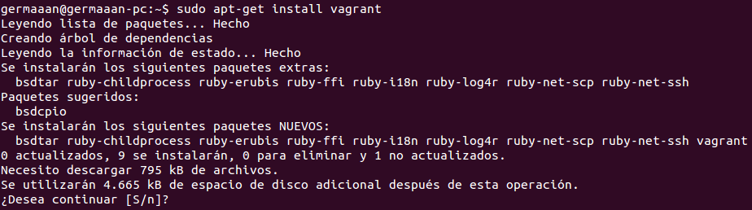
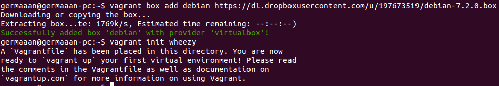
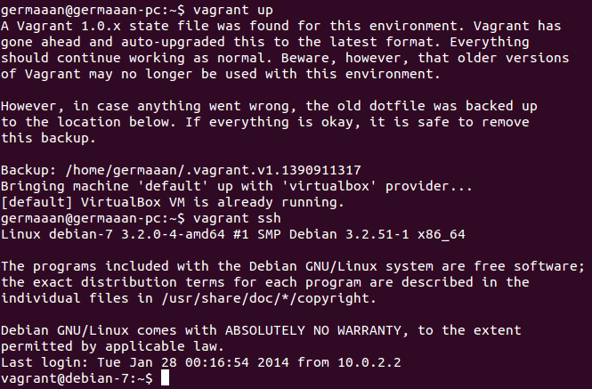

# Ejercicios 6:
### Instalar una máquina virtual Debian usando Vagrant y conectar con ella.

Antes de crear una máquina virtual con Vagrant debemos instalarlo, además Vagrant depende de VirtualBox, por lo que tendremos que instalarlo también si no lo tenemos instalado (solo válidas versiones 4.0, 4.1 y 4.2). Instalamos Vagrant:

```
sudo apt-get install vagrant
```



Ahora nos descargamos una máquina configurada para Vagrant consultando la lista de disponibles en la página de [Vagrantbox.es](http://www.vagrantbox.es/). En mi caso voy a buscar una máquina con formato Virtualbox que tenga una instalación de Debian 7 (Wheezy), por ejemplo,  elijo [esta](https://dl.dropboxusercontent.com/u/197673519/debian-7.2.0.box). Lo siguiente será descargarla e inicializarla.


```
vagrant box add debian https://dl.dropboxusercontent.com/u/197673519/debian-7.2.0.box
vagrant init debian
```



Con esto se ha creado un archivo llamado **Vagrantfile** en el directorio actual, un archivo con sintaxis Ruby que nos permitirá configurar la máquina en función a nuestras necesidades. La gran mayoría de las opciones vienen comentadas en un principio, por lo que la configuración queda como sigue:

```
# -*- mode: ruby -*-
# vi: set ft=ruby :

Vagrant.configure("2") do |config|
  config.vm.box = "debian"
end
```

La única configuración indicada es el box que usa para la máquina virtual, aunque entre las líneas comentadas podemos encontrar las opciones de configuración de red, reenvío de puertos, carpetas compartidas o configuración de Puppet o Chef. Lo siguiente será iniciar la máquina para poder conectarnos a ella:

```
vagrant up
vagrant ssh
```


