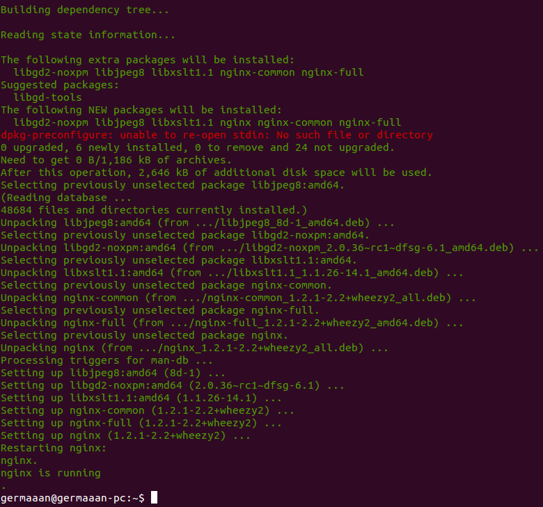

# Ejercicios 7:
### Crear un script para provisionar `nginx` o cualquier otro servidor web que pueda ser útil para alguna otra práctica

Tenemos diferentes formas de provisionar una máquina con Vagrant usando el provisionador **shell**. La forma más simple es usando la directiva **inline** que nos permitirá ejecutar comandos directamente que si como si estuvieramos trabajando en un terminal diréctamente.

* Vagrantfile:

```
# -*- mode: ruby -*-
# vi: set ft=ruby :

Vagrant.configure("2") do |config|
  config.vm.box = "debian"

  config.vm.provision "shell",
    inline: "sudo apt-get update && sudo apt-get install -y nginx && sudo service nginx restart && sudo service nginx status"

end
```

Y ahora indicamos a Vagrant que queremos provisionar dicha máquina:

```
vagrant provision
```



Otra opción sería usar un archivo externo, como puede ser un [script](scripts/instala_nginx.sh) en nuestro sistema o un [Gist](https://gist.github.com/germaaan/8667325) de Github. En este caso podemos usar la directiva **path** para indicar la ruta hacia el script.

```
# -*- mode: ruby -*-
# vi: set ft=ruby :

Vagrant.configure("2") do |config|
  config.vm.box = "debian"

  config.vm.provision "shell",
    #path: "instala_nginx.sh"		# Comentar una de las opciones
    inline: "curl -s https://gist.github.com/germaaan/8667325/raw/f6854e9ea316d2a36ebd0498b7d701fa51d91842/instala_nginx.sh | sudo sh"

end
```
