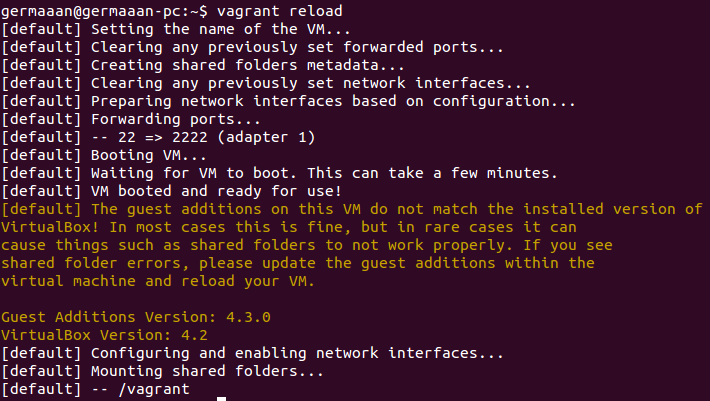
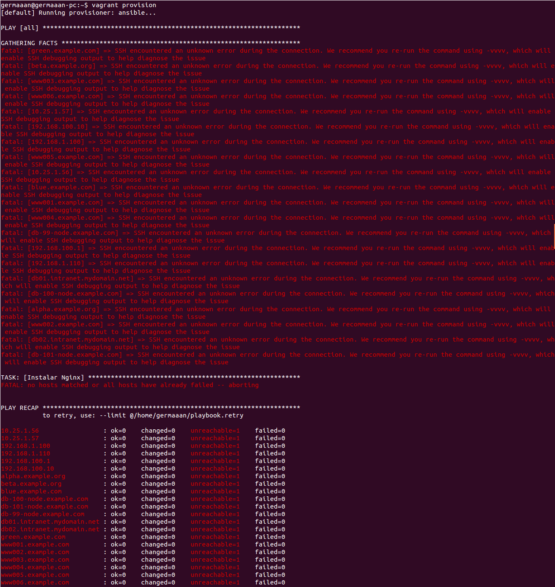

# Ejercicios 8:
### Configurar tu máquina virtual usando vagrant con el provisionador ansible.

Ahora vamos a usar Ansible para provisionar las máquinas virtuales, pero antes tenemos que asignarle una dirección IP a nuestra máquina Vagrant para poder indicarle a Ansible la máquina a la que tiene que conectarse y configurar. Indicamos esta configuración en el Vagrantfile introduciendo la siguiente línea con una IP que sea accesible desde nuestro ordenador:

```
config.vm.network :private_network, ip: "192.168.2.50"
```

Para que está configuración sea efectiva debemos recargar la configuración del Vagrantfile:

```
vagrant reload
```



Para indicar que vamos a usar provisionamiento mediante Ansible tenemos realizar la configuración sobre el provisionador **ansible**, con la directiva **playbook** indicamos el nombre y la ruta del playbook que vamos a usar para realizar la configuración. Según la documentación, no es necesario indicar un archivo de inventario, Vagrant genera uno para cada uno de las máquinas virtuales que controla.

```
Vagrant.configure("2") do |config|
  config.vm.box = "debian"
  config.vm.network :private_network, ip: "192.168.2.50"

  config.vm.provision :ansible do |ansible| 
    ansible.playbook = "playbook.yml"
  end

end
```

El contenido del playbook es básico, hacer lo mismo que los scripts del ejercicio anterior, instalar Nginx y comprobar que se está ejecutando.

```
---
- hosts: all
  sudo: yes
  tasks:
    - name: Instalar Nginx
      apt: name=nginx state=present
    - name: Comprobar Nginx
      command: service nginx restart && service nginx status
```

Solo queda comprobar que funcione, pero no funciona, aunque se incluya la directiva **inventory_path** para indicar la ruta de un archivo inventario con los host controlados.


```
vagrant provision
```


